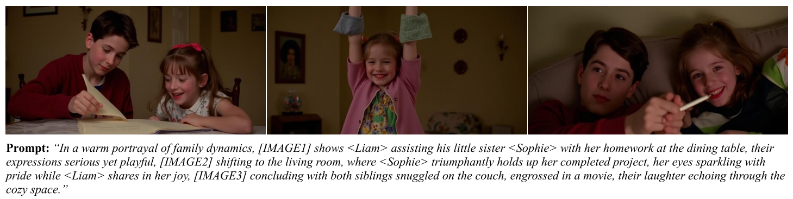

> [In-Context LoRA for Diffusion Transformers](https://arxiv.org/abs/2410.23775)
>
> [源码](https://github.com/ali-vilab/In-Context-LoRA)

# 贡献

- 论文中经过实验认为，以 FLUX-1.x 为主的扩散模型已经拥有<u>*在多种任务上*</u> (e.g. 图像翻译、风格迁移、姿势迁移和主题驱动生成等) 的 <u>*zero shot 能力*</u>，不需要经过大量数据的训练就可以<u>*完善这些能力*</u>
- 将多张训练图像<u>*组合成一个图像*</u>，将<u>*提示词也合并在一起*</u>，使用 <u>*LoRA 进行训练*</u>

# 思路

- 使用 <u>*In-Context LoRA*</u> 生成和训练的图像如下，

  

  > 这里的 `[IMAGE1]` 和 `<Liam>` 之类的好像不是占位符，也不是特殊的 visual embedding，可能是某种提示词工程技术？

  可以看到<u>*一次性生成*</u>的“长图像“包含了 3 张不同的图像，它们有着<u>*不错的一致性*</u>

