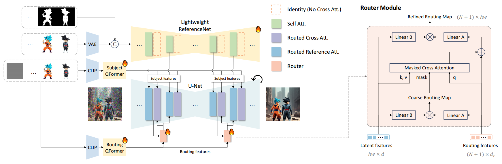
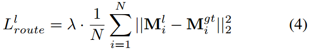
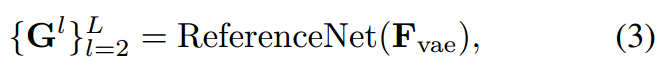
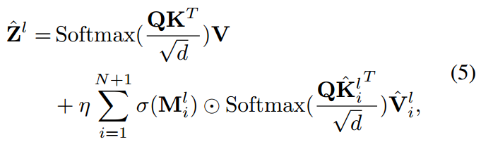
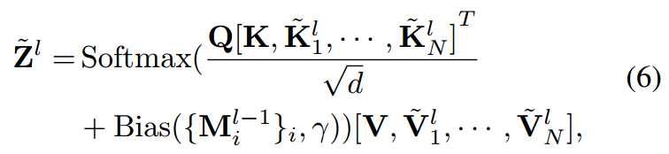
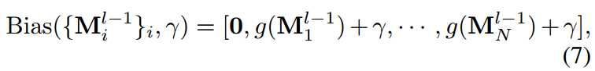
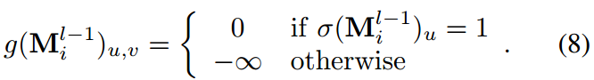

[toc]

> [AnyStory: Towards Unified Single and Multiple Subject Personalization in Text-to-Image Generation](https://arxiv.org/pdf/2501.09503)

# 贡献

- 可以<u>*统一处理一个 "subject" 和多个 "subject"*</u>
- 使用 <u>*ReferenceNet 从 feature map 层面*</u>引入新的 "subject" 概念
- 使用 <u>*QFormer*</u> 在 CLIP 的基础上<u>*更好地对 image 进行 encode*</u> (更接近 text embedding 空间)

- 使用了名为 "encode-then-route" 的思路 (简言之，除了对 "subject" 进行 encode，还通过 ROI 或 feature map 的方式<u>*指明位置*</u>)；主要通过 <u>*masked attn*</u>

# 思路

## Framework

**"CLIP" encoding**

- 将 CLIP embedding 通过 QFormer，进一步<u>*和 text embedding 对齐*</u> (某种程度上替代了 linear 层的作用)

  > QFormer 是一个轻量的 Transformer，专门设计用于跨模态任务 (e.g. 视觉-语言)，将 <u>*visual embedding 转为 text embedding*</u>

- 论文中输出的 <u>*routing feature*</u> (上图中的 Routing QFormer) 记作 $R_i^l$ (l-th "subject" 的 routing feature)；会<u>*额外增加一类 "subject"，表示完全空白*</u>

**Decoupled routing mechanism**

- <u>*routing feature 和 latent feature 计算得到 masked attn map*</u> (可以看做提前计算一个比较粗糙的 <u>*ROI 当做 mask*</u>)

  > 原文：Specifically, in each cross-attention layer of the U-Net, we first predict a coarse routing map by taking the linearly projected inner product of $\{R_i\}_{i=1}^{N+1}$ and $Z_l$

- **损失函数**

  

  $M_i^{gt}$ 表示第 $l$ 层对应的 <u>*gt 的 segmentation mask*</u>

  > 原文：$M_i^{gt}$ represents the downsampled ground truth mask of the i-th subject in the target image.
  >
  > 根据损失函数反推，感觉 route 的主要作用可能就是注入位置信息 (i.e. mask)

**Lightweight ReferenceNet**

- ReferenceNet 使用的是 UNet 结构，并且和 sd 中的 UNet 在输入输出<u>*结构上是对齐的*</u>

  > 另一个原因，估计是 AnyStory 和 ReferenceNet 都是阿里的

- 通过 <u>*feature map 的形式注入*</u> "subject"；根据此处的需求，ReferenceNet 不需要注入 text embedding，i.e. 不需要 SpatialTransformer 结构 (上图中的虚线框)，<u>*这部分的参数可以省去*</u>

- ReferenceNet 的<u>*输入是 "subject" image 和对应的 segmentation map*</u>

  

  一共有 $L$ 层

**routing feature and subject feature injection**

- <u>*$K$ 和 $V$ 来自 subject QFormer feature*</u>

- $\sigma$ 表示将 $M_i^l$ 这个 mask 变为"真正的"<u>*二元矩阵*</u>

  > 原文：$\sigma(M_i^l)$ represents the “0-1” version of $M_i^l$ after operations argmax and one-hot
  >
  > 但是没有看懂这里到底是如何转换为二元矩阵

- <u>*$\tilde K$ 和 $\tilde V$ 来自 routing QFormer feature*</u>

> 简单来看，感觉是在 ROI 的基础上，学习预测 mask，然后在反过来加强 mask 部分的 ROI

**ReferenceNet feature injection**

- 通过 <u>*attn 融合*</u>，

  

  一共引入 $N$ 个 "subject"；$\tilde{K_i^l}=G_i^l\tilde{W_k^l}$，$\tilde{V_i^l}=G_i^l\tilde{W_v^l}$，$Q=Z^lW_q^l$

  <u>*Bias 计算方式*</u>为，

  

  

  根据公式 (8)，如果当前像素点<u>*与 "subject" $i$ 不相关*</u>，则将 score 设置为 $-\infin$，i.e. 经过 Softmax 后接近 0，相当于<u>*不分配权重*</u>

> ReferenceNet 应该是在 feature map 层面上融合的 (看结构图对应的好像是 ResBlk)，为什么要使用这么复杂的一个 attn？

## Training Strategy

- 先训练除了 router module 的部分，这部分训练需要成对的数据 (e.g. 从视频中提取同一个角色的数个不同的动作)，这个阶段应该只出现一个 "subject"；只使用重建损失
- 然后训练 router module，这部分不需要成对数据 (e.g. 一个存在好几个人的图像)，这个阶段会出现多个 "subject"，学习如何 decouple 不同 "subject" 的 feature；使用重建损失，和 

# Ablation

- ReferenceNet encoder 有效
- 通过 router module 为多个 "subject" 的 feature 分别进行生成，避免 feature 相互影响，同时指定 ROI 的设计是有效的

