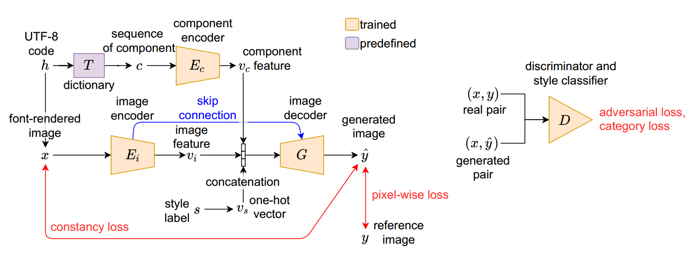
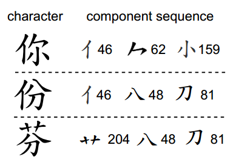

[toc]

> [CalliGAN: Style and Structure-aware Chinese Calligraphy Character Generator](https://arxiv.org/abs/2005.12500)
>
> [源码](https://github.com/JeanWU/CalliGAN)

# 贡献

- 使用一种<u>*比部首更高阶的部件*</u>分类方式，注入“部首”级的 content 控制信息
- 主要关注中国书法字

> 感觉只能算是对 zi2zi 的轻度修改，大部分思路都在 zi2zi 中实现了

# 思路

## Framework

**image encoder**

- 先使用新宋体<u>*绘制 content image*</u> (e.g. 上图中的 font-rendered image)

  然后使用 <u>*image encoder 提取 content feature*</u> (image encoder 是经典的卷积 + 激活函数 + 批归一化 + dropout)

**component encoder**

- 本文使用的是一种比中文部首<u>*更高阶的部件*</u>；共 517 个

  

  >Chinese Standard Interchange Code (但官网打不开)

- 转为 <u>*embedding 后，使用 LSTM 进行降维提取*</u>

  > 太古早了这个技术

**损失函数**

- 对抗损失
- 像素级损失
- 重新通过 image encoder 提取 content，对比 gt 和生成图像的 content
- 生成图像通过 style 分类器损失

## 数据集

- 从网络上收集了 7 位书法家以楷体为主的字体，每个作家收集了 6000 字左右

  > 果然草书问题在这个阶段还是不太好解决
  >
  > [网址](http://163.20.160.14/˜word/modules/myalbum/)，但好像也进不去了

# Evaluation Metric

- MSE
- SSIM

