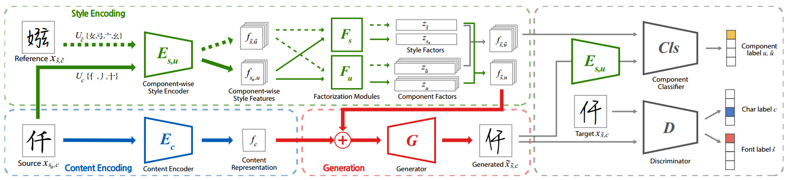

[toc]

> [Few-shot Font Generation with Weakly Supervised Localized Representations](https://arxiv.org/abs/2112.11895)
>
> [源码](https://github.com/clovaai/lffont)
>
> AAAI 2021

# 贡献

- 训练了一个<u>*在 component-level 上从中文字符中提取 component 对应 style feature 的结构*</u>
- 将字体风格转化问题解释为<u>*矩阵分解问题*</u>，通过已有的 component 和 style feature 的对应关系，预测未知的对应关系

# 思路

## Framework

**Component-wise Style Encoder**

- 预先收集每个字符可以被拆分为哪些 component，向 Component-wise Style Encoder <u>*输入 component id*</u>，通过学习 Component-wise Style Encoder 可以<u>*提取出这个 component 在这个字体的这个文字中的 style feature*</u>

**Factorization Modules**

- 类似<u>*矩阵分解*</u>的操作

**Content Encoder**

- 提供<u>*全局的 content 信息*</u> (i.e. 有了 target style 的 source component 后，还要知道怎么组装在一起)

**损失函数**

- $L_{adv(font)}$，分类器判断生成图像的 font 类型计算 loss
- $L_{adv(char)}$，分类器判断生成图像的 character 类型计算 loss
- $L_{L_1}$，像素级别的 loss
- $L_{feat}$，Discriminator 中按层计算 feature map 级别的 loss
- $L_{cls}$，对生成图像提取出 component 计算 loss
- $L_{consistent}$，来自相同风格的不同 component 提取出的风格因子应该很接近，而来自不同风格的相同 component 提取出的部件因子应该很接近，将<u>*两者的方差*</u>作为损失函数

## 数据集

> [每个中文字符对应 component ](https://github.com/clovaai/lffont/blob/master/meta/chn_decompose.json)
>
> [字体库地址](https://chinesefontdesign.com/font-housekeeper-song-ming-typeface-chinese-font-simplified-chinese-fonts.html)

- 使用开源的字体库生成训练数据

  482 种字体，每个字体 6,654 个字符

# Evaluation Metric

- LPIPS
- Acc：font acc，character content acc，两者的平均 acc

- FID

# Ablation

- 损失函数设计有效
- Component-wise Style Encoder，Factorization Modules，Content Encoder 有效