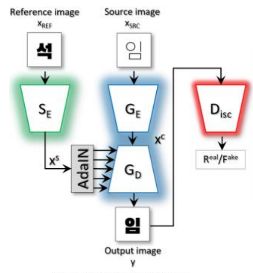
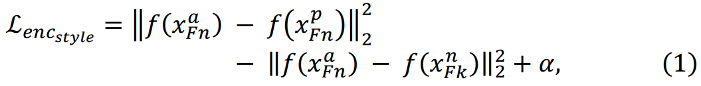

[toc]

>[FontNet: Closing the gap to font designer performance in font synthesis](https://arxiv.org/abs/2205.06512)

# 贡献

- 将 <u>*triplet loss 应用到 style encoder 的训练中*</u> (triplet loss 可以看做一种对比学习 contrastive learning)

# 思路

## Framework

- 该模型在 StyleGAN 上做修改，将无条件生成改为有条件生成，使用 <u>*AdaIN 注入 style feature*</u>

**triplet loss**

- triplet loss 的计算公式为：$L=\max({d(a,p)-d(a,n)+margin, 0)}$

  $a$ 表示 anchor，$p$ 表示正样本 positive，$n$ 表示负样本 negative，$d$ 表示 distance；简言之，希望 (a, p) 之间的距离比 (a, n) 之间的距离更近；$margin$ 一般是一个正的常数，以保证 (a, p) 的距离更近而不是保持一致

- 将以上的思路应用到 style encoder 的训练上，

  

# Evaluation Metric

- SSIM
- FID
- Content Acc，Style Acc

# Ablation

- triplet loss 训练的 style encoder 有效