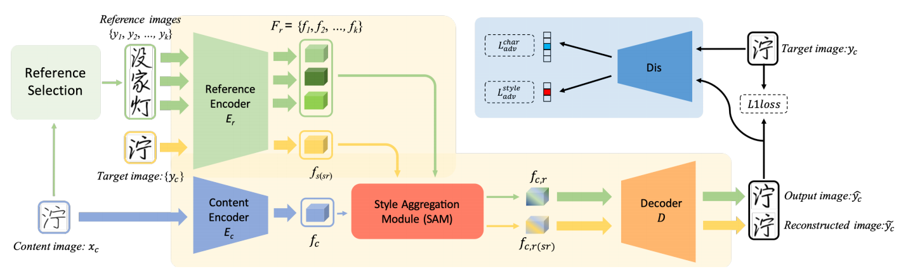
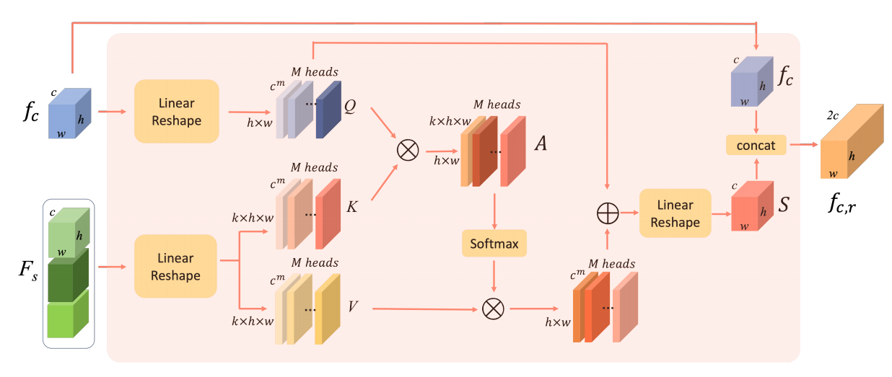
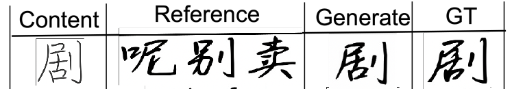
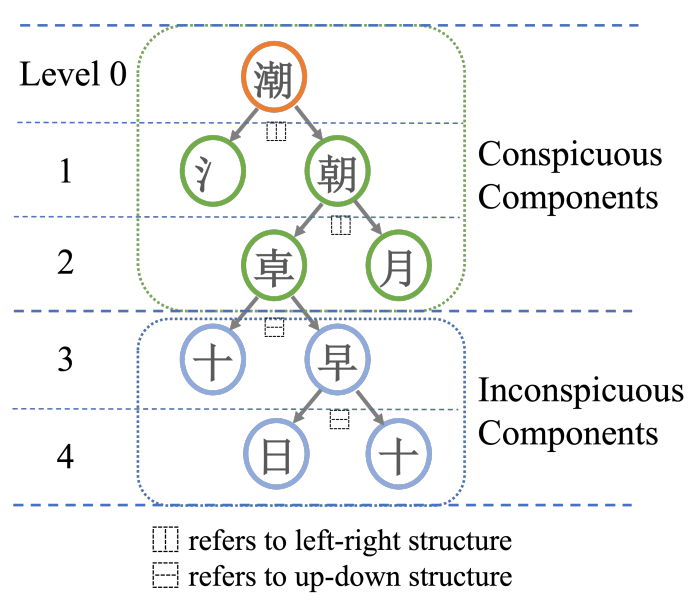

[toc]

> [Few-Shot Font Generation by Learning Fine-Grained Local Styles](https://arxiv.org/abs/2205.09965)
>
> [源码](https://github.com/tlc121/FsFont)
>
> CVPR 2022

# 贡献

- 引入 <u>*attn 机制融合 style feature embedding 和 content feature embedding*</u>
- 提出了<u>*从 component 层面更好地选择 reference image 的方式*</u>

# 思路

## Framework

**Style Aggregation Module (SAM)**

- <u>*content feature embedding 作为 query，style feature embedding 作为 key 和 value*</u>

> 很好奇为什么之前的工作哪怕使用到 attn 融合，也是在 feature map 上做

**损失函数**

- 对抗损失
- 和 gt 计算 pixel-level 的 loss
- <u>*将 gt 作为 reference image*</u> 额外生成一次图像，也计算上面这两种 loss

**Reference Selection**

- <u>*问题描述*</u>：如果 <u>*reference image 在 component 上无法涵盖 content image 的需求*</u>，会降低生成图像的质量

- 论文提出了<u>*新的 reference set 的收集方式*</u>，以尽可能让 reference image 涵盖 content 的需求

  

  比如 "呢，别，卖" 大体上就可以组成 "剧"

- 收集的方式主要是递归地将字符<u>*拆分为最小单位的 component*</u>

  

  如果已经收集了可拆分为 (A, B, C) 的字符，那么 (A, B, D) 被收集，而 (A, B) (A, B, C) 都被丢弃

## 数据集

> [字体库地址](https://chanind.github.io/hanzi-writer-data/)

-  407 个 fonts，每个字体 3396 个字符

# Evaluation Metric

- L1 loss
- RMSE
- SSIM
- LPIPS

# Ablation

- SAM 模块有效
- 将 gt 作为 reference image 计算损失函数有效
- Reference Selection 机制有效