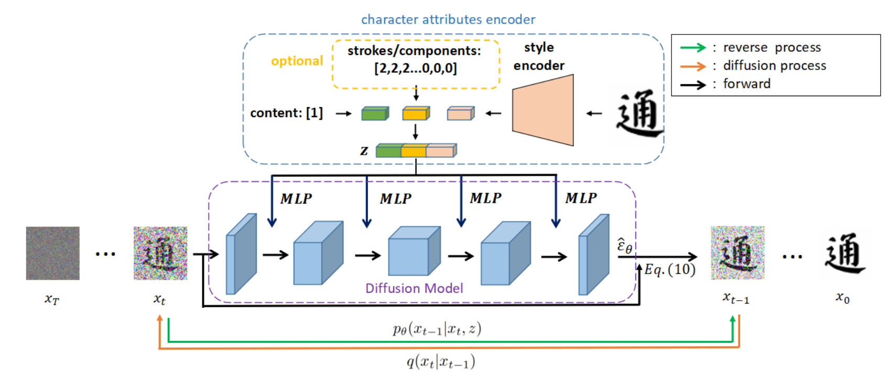
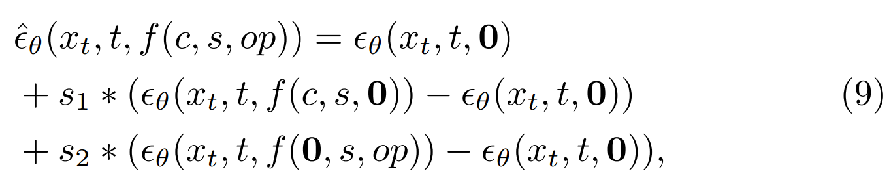

[toc]

> [Diff-Font: Diffusion Model for Robust One-Shot Font Generation](https://arxiv.org/abs/2212.05895)
>
> [源码](https://github.com/Hxyz-123/Font-diff)
>
> International Journal of Computer Vision, Volume 132

# 贡献

- 第一次将 diffusion model 使用到字体生成任务上
- 将 <u>*content id embedding，stroke embedding，style embedding*</u>，<u>*concat 后作为控制输入*</u>
- <u>*带有数量的 stroke embedding*</u>；新增额外<u>*考虑 content、stroke、style 的 guidance*</u>

# 思路

## Framework

- 将 <u>*content id embedding，stroke embedding，style embedding*</u>，<u>*concat 后作为控制输入*</u>

- stroke embedding 来自 StrokeGAN，增加了对于 <u>*stroke 数量*</u>的表示

  

- 在 concat 后，<u>*与 timestamp embedding 相加融合*</u>

  > 这个时间点还没有经典的 sd 的结构，所以注入方式没有使用 encoder_hidden_state

- <u>*考虑 content ($c$)、stroke ($op$)、style ($s$) 的 guidance*</u>

  

## 数据集

- 410 种 font，每种 font 6,625 个中文字符

# Evaluation Metric

- SSIM
- RMSE
- LPIPS
- FID

# Ablation

- 带有数量的 stroke embedding 有效
- guidance 有效