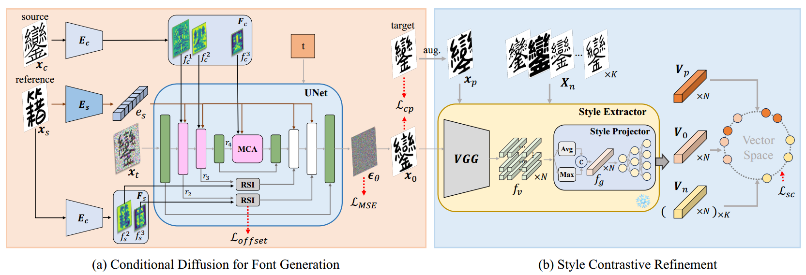
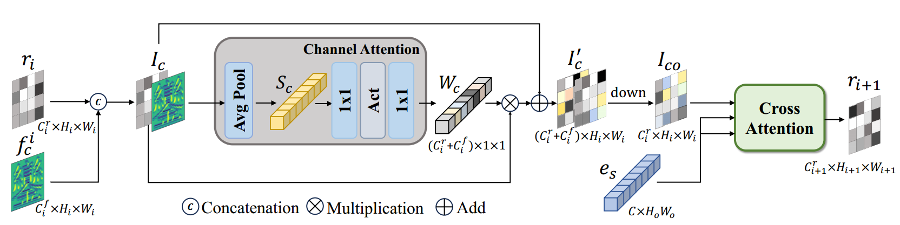
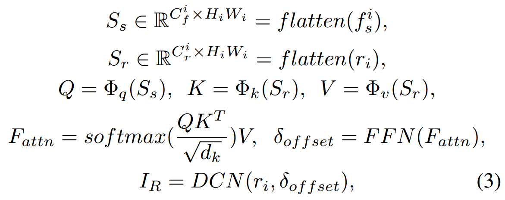
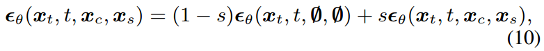

[toc]

> [FontDiffuser: One-Shot Font Generation via Denoising Diffusion with Multi-Scale Content Aggregation and Style Contrastive Learning](https://arxiv.org/abs/2312.12142)
>
> [源码](https://github.com/yeungchenwa/FontDiffuser)
>
> AAAI 2024

# 贡献

- 沿用 DG-Font 的思路，在 <u>*skip connection 中加入 DCN*</u>，提出<u>*使用 attn 的方式计算 offset*</u>
- 通过<u>*对比学习对 style embedding*</u> 的学习进行监督

# 思路

## Framework

**Multi-scale Content Aggregation (MCA)**

- 该模块中会<u>*注入 content feature map 和 style embedding*</u>

- 由于 UNet 每一层的 feature map 有着不同的分辨率，所以也将 <u>*content image 转为对应的分辨率进行融合*</u>

> 为什么不直接使用 ControlNet 呢？

**Reference-Structure Interaction (RSI)**

- 在 <u>*skip connection 中加入 DCN*</u>，<u>*使用 attn 的方式计算 offset*</u>

  

  $f_s^i$ 表示从 reference image 中提取到的 content embedding，$r_i$ 表示 latent feature embedding

**训练策略**

- 第一阶段先不引入 SCR 获取到的对比损失；第二阶段引入对比损失

**损失函数**

- **Style Contrastive Refinement (SCR)**
  - 提前进行<u>*预训练*</u>
  - 通过<u>*对比学习对 style encoder*</u> 进行监督
- feature-level 的 $l_2$ loss，将 gt 和生成的图像通过 VGG 网络提取 feature (有点像 LPIPS)

**推理时 guidace**

## 数据集

- 424 种 font，每个 font 800 个字符

# Evaluation Metric

- 通过不同的笔画数量将文字的生成难度分级，

  Easy：6 到 10；Medium：11 到 20；Hard：超过 21

- 在 seen/unseen font，seen/unseen character 上组合做测试 (e.g. UFUC，SFUC e.t.c.)

- FID
- SSIM
- LPIPS
- L1

# Ablation

- MCA，RSI，SCR 三个新增结构均是有效的
- 使用 cross attention 计算 offset 优于使用 CNN