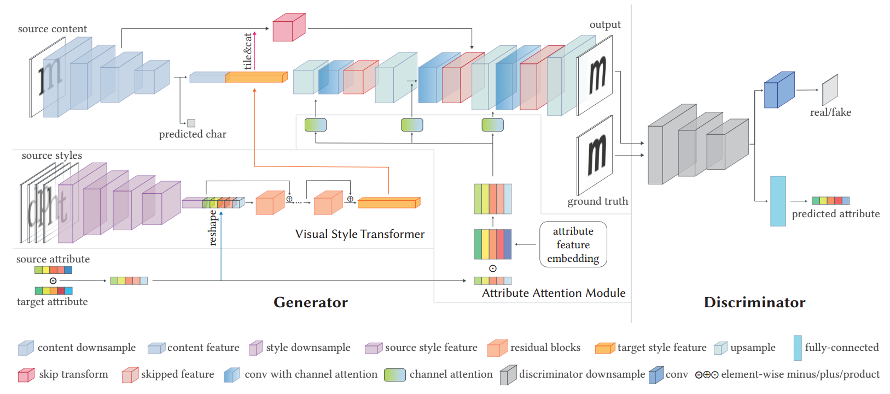
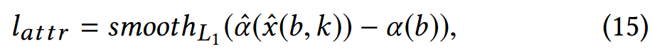
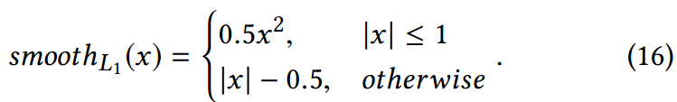
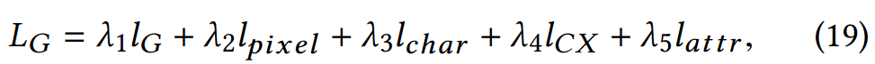

[toc]

> [Attribute2Font: Creating Fonts You Want From Attributes](https://arxiv.org/abs/2005.07865)
>
> [源码](https://github.com/ueoo/Attr2Font)
>
> ACM Trans. Graph. 39(4)

# 贡献

- 从 <u>*feature map 和 embedding 两方面*</u>，以<u>*属性值的方式*</u> (i.e. <u>*属性值差值*</u>) 进行字体风格迁移

# 思路

## Framework

- 在训练和推理过程中，输入<u>*一系列使用 source styles 的 image*</u>，然后通过<u>*调整 attribute value*</u> (e.g. 0-100，将某个 attr 调整为 20)，生成 target style 的 image

### Visual Style Transformer (VST) —— feature map 层面注入字体属性

- 论文中将字体的 style 设置为 <u>*37 种不同的属性*</u> (e.g. 倾斜、粗细等)，转换为 token (e.g. one-hot)
- 通过一系列 <u>*CNN 网络提取 source styles image*</u> 在 feature map 层面上的 style feature；并且和 <u>*source attr 和 target attr 之间的差值*</u> concat 在一起
- <u>*content feature*</u> 同样使用一系列 CNN 网络提取

### Attribute Attention Module (AAM) —— attention 层面注入字体属性

- 通过矩阵乘法将 attr 向量<u>*提升为矩阵*</u> (e.g. $m\times1$ 与 $1\times m$ 得到 $m\times m$ 矩阵)

  > 论文中好像没有解释为什么要使用这种方式将 vector 升维成矩阵

  以 <u>*channel attention 的方式融合*</u>到 feature map 中

  > channel attention 是将 feature map 提取为 $C\times 1\times 1$ 的矩阵，<u>*在 channel 上进行筛选*</u>

### 损失函数

- $l_G$ 是生成器损失

- $l_{pixel}$ 是和 gt 在 pixel-level 的损失

- $l_{char}$ 是经过文字识别模型得到的 cross entropy

- $l_{CX}$ 指的是 contextual loss，一种更宽松的计算图像相似度的方法

- $l_{attr}$ 是将生成的图像重新提取出 attr，然后和 gt attr 计算损失

  > 论文中对 $l_{attr}$ 进行了平滑，但没有对这么设计平滑做出解释
  >
  > 
  >
  > 

- 完整的损失函数，

  

## 数据集

> [数据集地址](https://drive.google.com/file/d/1TTqAklfsAp6KOPxCVl2jktH8kN4lEmI_/view)

- AttrFont-ENG 这个数据集是第三方提供的，使用 37 种 attr 标注了一些字体；AttrFont-CN 则是通过为中文字体找到接近的中文字体，然后复用英文字体的 attr

  > 但论文中好像没有解释这个找到接近英文字体的算法是如何实现的

- 对于没有标注 attr 的数据，通过学习的方式得到

  > 原文：In the training phase, the attribute values of labeled fonts are fixed but the ones of unlabeled fonts are fine-tuned via the gradient descent algorithm.
  >
  > 但是没有很理解这里被训练的是哪个网络，按照论文的说法，未标注 attr 的数据的 37 种 attr 会使用高斯分布作为初始化，而将 attr 做嵌入的 embedding 层应该本来就是要训练，那么到底如何训练呢？
  
  

# Evaluation Metric

- Inception Score (IS)
- FID
- LPIPS
- SSIM：从亮度、对比度和结构三个维度来衡量图像的相似性
- pixel-level accuracy

# Ablation

- VST 与 AAM 结构有效

- source styles image 可以任意选择

  > 论文中说当然如何可以接近 target style image 更好，感觉有一点废话

- attr 进行向量化是有效的，e.g. 可以用于 font  interpolation、通过随机化 attr 创造新的 font

- 有跨语言的潜力，e.g. 将中文和英文的 attr 值对应起来