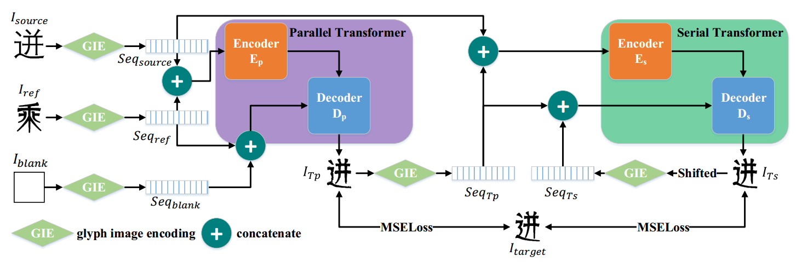
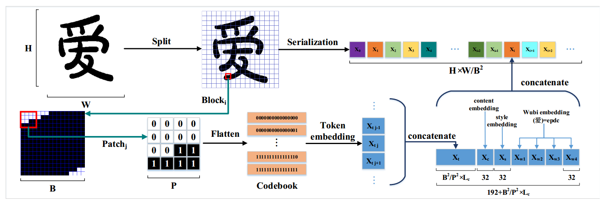

[toc]

> [FontTransformer: Few-shot High-resolution Chinese Glyph Image Synthesis via Stacked Transformers](https://arxiv.org/abs/2210.06301)

# 贡献

- 模仿 ViT 的思路，将<u>*图像划分为 patch*</u>；同时构建了<u>*用于文字生成的 embedding 方式*</u>
- 使用二阶段的 transformer 结构，第一阶段使用<u>*并行的 transformer*</u>，第二阶段使用<u>*串行的 transformer*</u>

# 思路

## Framework

**glyph image encoder (GIE)**

- GIE 中使用了一个”很细粒度“的 patchify 方式；<u>*`token embedding` 是一个 patch 展平后的向量，`content embedding` 是 content id 向量化 (共 6763 个 content)，`style embedding` 是 style id 向量化 (共 300 个 style)，`wubi embedding` 是五笔输入法向量化*</u>，<u>*concat 在一起*</u>

  > 感觉是因为汉字一般是单通道二值化的图像，没有很多的取值可选，计算压力没有很大，所以可以使用”更细粒度“的 patchify 方式

**Parallel Transformer 和 Serial Transformer**

- Parallel Transformer 使用了 <u>*Informer 中 generative inference*</u> 的思路 (可以并行生成，不需要依赖上一时间步的输出)

  > 介绍 Informer 的文章都说要使用 encoder 输入中已知的值作为 `<start token>` 替代 decoder 的输出，但是文字生成应该没有已知的值吧，难道是用的 content image？(毕竟 target style 的 content image 在 glyph 结构上一般和 source style 的 content image 还是挺像的)

- Parallel Transformer 中 decoder 输入的 $Seq_{blank}$ 可能是为了和 encoder 输入是两个 seq concat 在一起保持一致的结构

- 其余 <u>*encoder 和 decoder 的输入见上图*</u>

**masked attention**

- 对于汉字的二值化图像来说，有<u>*大部分的区域是以空白为主的*</u>，这些 seq 不应该赋予权重，所以直接 mask 掉

**损失函数**

- Parallel Transformer 和 Serial Transformer 的<u>*输出分别和 gt 计算 MSE loss*</u>

## 数据集

- 251 种字体，约 1.7M 个字形图像

# Evaluation Metric

- MAE：i.e. l2 loss
- FID
- Content Acc，Style Acc

# Ablation

- Parallel Transformer 和 Serial Transformer 设计有效
- glyph image encoder 设计有效
- masked attn 设计有效