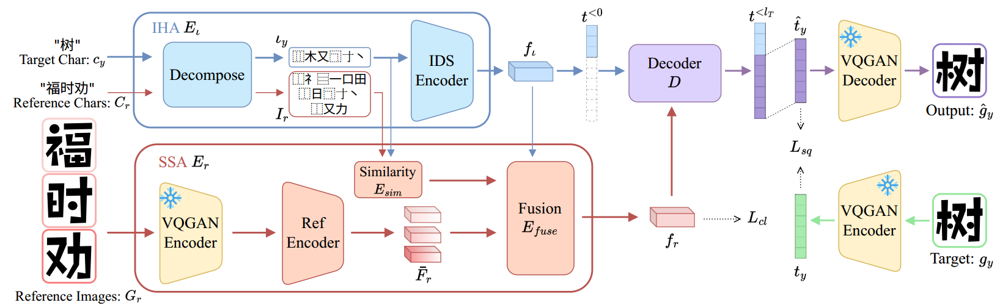
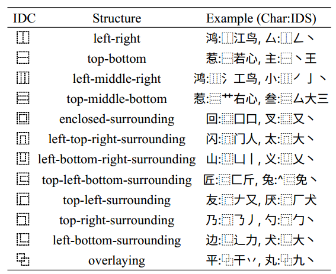
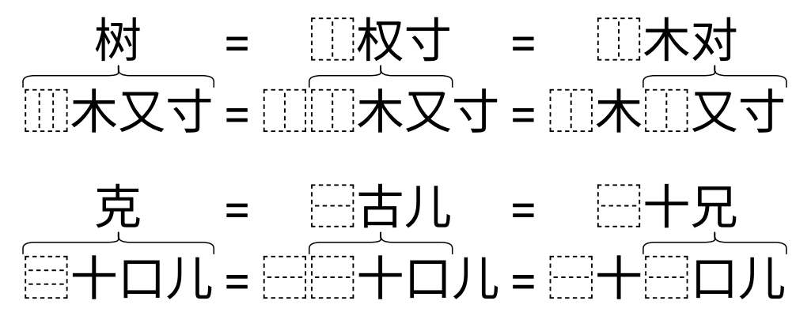
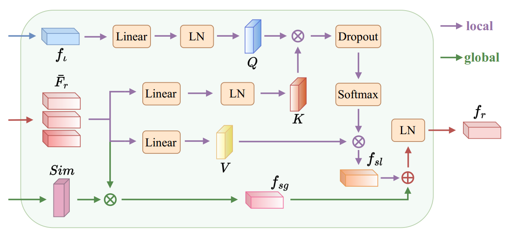

[toc]

> [IF-Font: Ideographic Description Sequence-Following Font Generation](https://proceedings.neurips.cc/paper_files/paper/2024/file/19ded4cfc36a7feb7fce975393d378fd-Paper-Conference.pdf)
>
> [源码](https://github.com/hfhchan/ids)
>
> NeurIPS 2024

# 贡献

- 将字体风格迁移转为<u>*序列预测任务*</u>，即根据 content image token 自回归地预测后续的 token

- 根据 <u>*Ideograph Description Sequence (IDS)*</u>，i.e. 一种表明汉字部首间的位置信息的表示方式，将<u>*常用的汉字的结构拆分为 12 种*</u>

  > [VQ-Font: Few-Shot Font Generation with Structure-Aware Enhancement and Quantization](https://arxiv.org/abs/2308.14018) 中也提出了 12 种常用的汉字结构，很有可能是同一种
  >
  > 但是这两篇文章的作者好像没啥关联，不知道这 12 种结构是如何总结出来的 (IDS 全部的结构不止 12 种)

# 思路

## Framework

**Ideograph Description Sequence (IDS) 与 IDS Hierarchical Analysis (IHA)**

- <u>*12 种*</u>常用的 IDS 结构，

  

- 同一个字符可能对应多个 IDS

  

> 论文中没有给 IHA (e.g. IDS Encoder) 的具体结构，考虑到是 sequence 预测任务，猜测是 transformer encoder 那一套

**Structure-Style Aggregation (SSA)**

- 比较经典的 <u>*content image embedding 作为 query，style embedding 作为 key 和 value*</u>
- 在 IDS 上比较 content image 和 reference image 的<u>*相似度*</u>，从而对 <u>*style embedding 进行加权相加*</u>

**损失函数**

-  **Style Contrast Enhancement (SCE)**，通过<u>*对比损失*</u>监督 style encoder

## 数据集

- 464 font，每个 font 3500 个字符

# Evaluation Metric

- 在 seen/unseen font 和 seen/unseen character 上分别测试
- 在不同数量的 reference image 上分别测试
- FID
- L1
- LPIPS
- RMSE
- SSIM

# Ablation

- IHA、SSA 和 SCE 均有效

