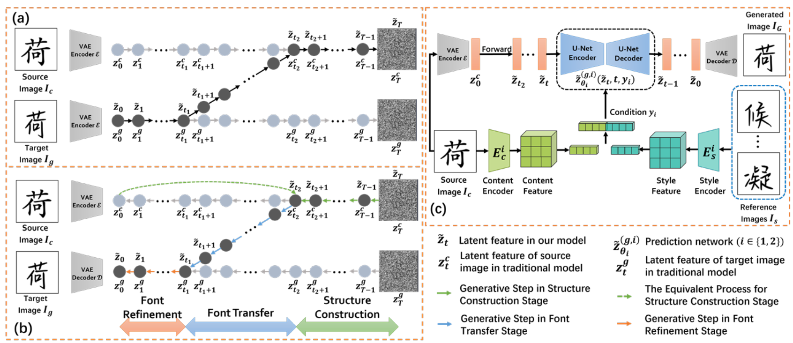

[toc]

> [Generate Like Experts: Multi-Stage Font Generation by Incorporating Font Transfer Process into Diffusion Models](https://openaccess.thecvf.com/content/CVPR2024/papers/Fu_Generate_Like_Experts_Multi-Stage_Font_Generation_by_Incorporating_Font_Transfer_CVPR_2024_paper.pdf)
>
> [源码](https://github.com/fubinfb/MSD-Font/issues)
>
> CVPR 2024

# 贡献

- 将字体风格迁移任务，拆分为了<u>*三阶段子任务*</u>，并使用<u>*两个独立的扩散网络进行噪声预测*</u>

# 思路

## Framework

- 论文中将字体风格迁移任务分为了 <u>*3 个阶段*</u>：（1）Font Refinement（2）Font Transfer（3）Structure Construction

**加噪过程**

- 在这三个阶段中，（1）和（3）阶段和一般扩散模型的加噪方式一致

  而 Font Transfer 部分的“一步加噪“公式为，

  

  

**双扩散网络与损失函数**

- $\tilde z_{{\theta}_1}$ 和 $\tilde z_{{\theta}_2}$ 分别表示<u>*两个独立的扩散网络*</u> (控制注入等网络也是独立的)；$y_1$ 和 $y_2$ 表示控制条件

> 很好奇推导出的损失函数为什么少了 [$t_2$, T] 这一段？

## 数据集

- 900 种 font，每个 font 800 个字符

# Evaluation Metric

- RMSE
- PSNR
- SSIM
- LPIPS