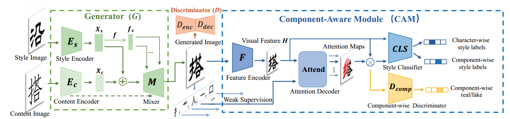
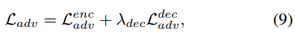
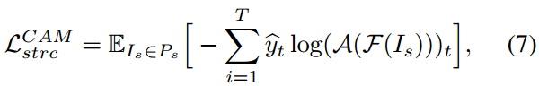
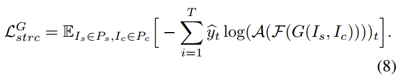
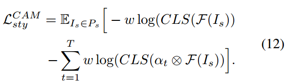
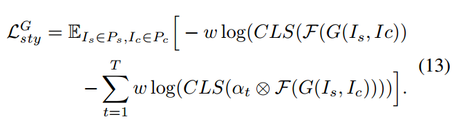
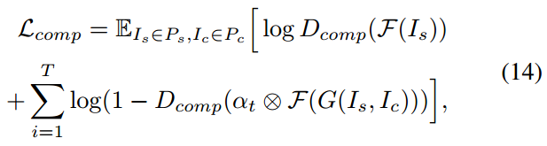
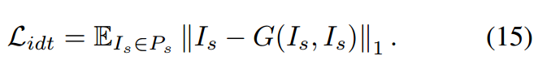
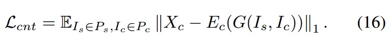

[toc]

> [Look Closer to Supervise Better: One-Shot Font Generation via Component-Based Discriminator](https://arxiv.org/abs/2205.00146)
>
> [源码](https://github.com/kyxscut/CG-GAN)
>
> CVPR 2022

# 贡献

- 引入 <u>*attn 机制来获取 component-level 的 feature*</u>
- 从 character 和 component 两个 level，在 style 和 content 两个方向上设计了<u>*很多的损失函数*</u>

# 思路

## Framework

- Generator 和 CAM 是一起训练的

  > 好奇在最开始 CAM 是随机提供损失函数的，是如何保证能够训练下去的？

**损失函数：**

- $L_{adv}$：这里上标的 $enc$ 和 $dec$ 原文中指的是，

  >Hence, we adopt a U-Net based discriminator [35], where the encoder part Denc and the decoder part Ddec perform per-image and per-pixel discrimination, respectively.

  应该是指上面结构图中上部橘黄色的 Discriminator 用的是 UNet 结构，将 Encoder 到 MiddleBlk 的输出做一次对抗损失，整个 UNet 的最后输出再做一次对抗损失

  

- $L_{strc}^{CAM}$：这里的 $strc$ 指的是 structure；$F$ 指的是 Feature Encoder，$A$ 指的是 Attention Decoder

  reference image (注意不是生成的图像) 通过 Feature Encoder 抽取 feature map，然后通过 Attention Decoder 获取 component 的 attention map，然后通过 component CLS 计算 CE loss

  

- $L_{strc}^G$：和上面的类似，不过这次的输入是生成图像了

  

- $L_{sty}^{CAM}$：整体和局部的 style 分别通过 style CLS 计算 CE loss

  

- $L_{sty}^G$：与上面同理

  

- $L_{comp}$：$L_{adv}$ 在整体生成图像层面计算了对抗损失，而 $L_{comp}$ 是在 component 层面计算对抗损失

  

- $L_{idt}$：将 $I_s$ 作为 content image 输入 (i.e. reference image 自己生成自己)

  

- $L_{cnt}$：$cnt$ 指 content；将生成的图像再传入 Content Encoder，提取 content feature 和  content image 计算 loss

  

# Evaluation Metric

- SSIM
- RMSE
- LPIPS
- FID

# Ablation

- CAM 以及对 component-level 的监督是有效的