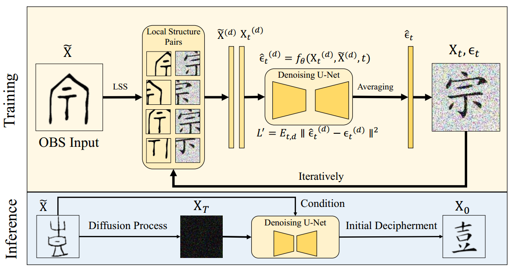
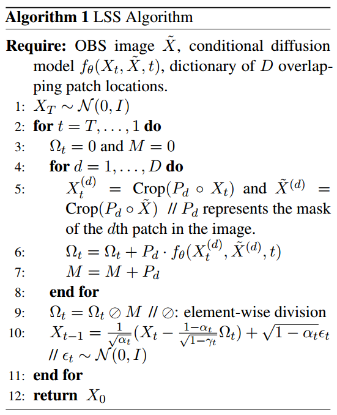
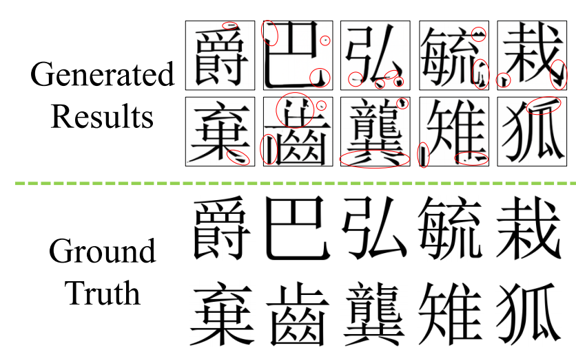
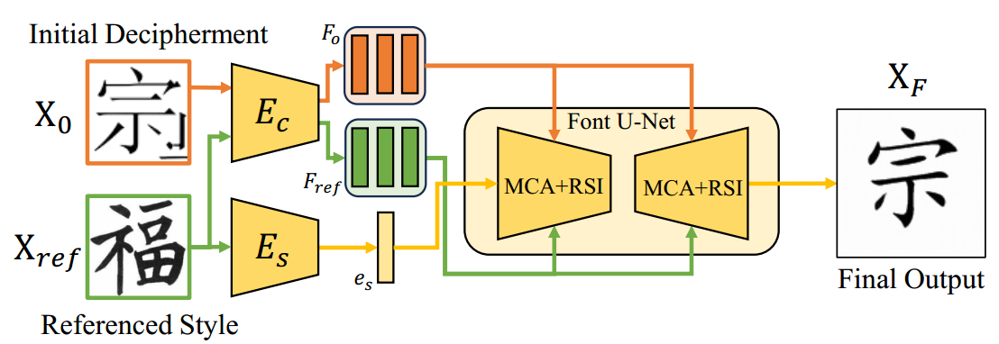

[toc]

> [Deciphering Oracle Bone Language with Diffusion Models](https://arxiv.org/abs/2406.00684)
>
> [源码](https://github.com/guanhaisu/OBSD)
>
> ACL 2024

# 贡献

- 构建了一个使用扩散模型将甲骨文翻译为简体中文的网络
- <u>*以 patch 为单位对图像进行去噪*</u>

# 思路

## Framework

**Initial Decipherment**

- 论文中提出，虽然甲骨文和简体字整体上的差距比较大 (i.e. 将甲骨文视作一个整体直接使用扩散模型进行“翻译”的效果不佳)，但<u>*在局部范围内 (i.e. patch) 的相似结构*</u>模型是更容易学习到的

- 算法的伪代码为，

  

  1. 将 latent image 划分为 patch (step 5)

     > 这里的 patch 应该是有一定的 overlap 的

  2. 对每一个 patch 进行噪声预测 (step 6)

     > $\Omega_t$ 初始化为 0 应该是当做了一个“画布”

  3. 记录 overlap (step 7)

     > $P_d$ 应该是二元矩阵，那么 $M$ 应该可以视作一个 "counter"，记录每个像素在这个循环中被预测了几次噪声

  4. 对 overlap 部分求平均 (step 9)

     > element-wise division 就是逐元素做除法

**Zero-shot Refinement**

- 经过上一步翻译出的简体字已经有大致的字形了，但是细节上仍然不足 (e.g. 有一些多余的笔画)

  

- 通过 FontDiffuser 进行修复

  > 应该是利用了 FontDiffuser 本身对字形的了解，起到了一个”修复“的作用

  

# Limitation

- 在附录 “A.2 Decipherment Results on Genuine Unknown OBS” 中给出了对目前人类也还无法“翻译”的甲骨文的对应简体字的预测，效果并没有特别好；所以该方法的泛化性可能有一定欠缺，有一点只是”记住了“对应关系的感觉