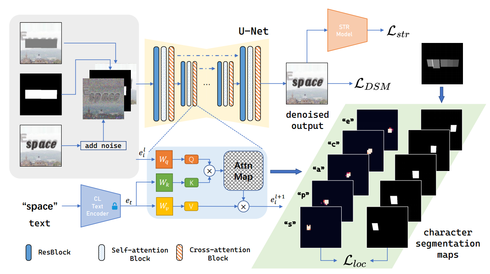
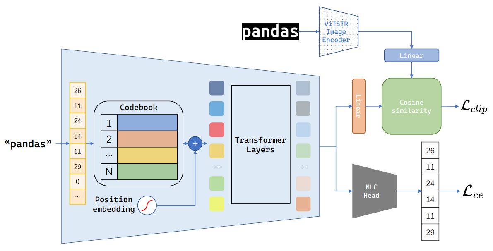
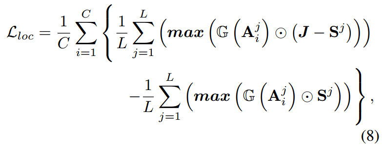
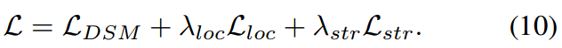
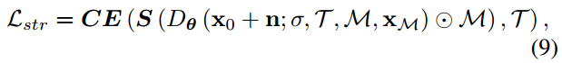
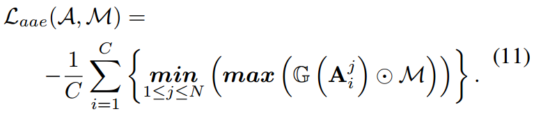
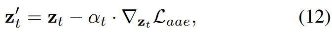

[toc]

> [UDiffText: A Unified Framework for High-quality Text Synthesis in Arbitrary Images via Character-aware Diffusion Models](https://arxiv.org/abs/2312.04884)
>
> [源码](https://github.com/ZYM-PKU/UDiffText)

# 贡献

- 一个<u>*基于 CLIP 的轻量级 character-level 字符文本编码器*</u>来提供字形信息
- 通过 ROI 在 <u>*cross attention 中提供位置信息*</u>
- 提出一个基于 <u>*localized attention 局部注意力损失*</u>和<u>*字符识别损失*</u>的损失函数
- 提出<u>*推理时优化*</u>，（1）选择较优的初始化高斯噪声（2）按照局部注意力损失对梯度进行引导 (类似 CFG 的变形)

# 思路

## UDiffText Framework

### 基于 CLIP 的 character-level 编码器

- *在 <u>tokenization 时，以 character 为单位</u>*
- transformer 作为文本编码器，ViTSTR 作为视觉编码
- 使用<u>*对比损失 $L_{clip}$*</u>，并将 transformer 的输出进过<u>*分类器还原回 token id 计算 CE loss*</u>

### localized attention 局部注意力

- $A_i^j$ 代表第 j 个 character (共 L 个 character) 在第 i 个 cross attention block (共 C 个 block) 中的 attention map；$G$ 表示 Gaussian blur，目的是让 attention 值更平滑；$S^j$ 表示第 j 个 character 对应的 segmentation mask；$J$ 表示全 1 矩阵

- 根据这个损失函数来解读，应该是对于不同的 character，<u>*segmentation mask 以外部分的 attention 最大值的平均值*</u>和与文本相关的 <u>*ROI 附近位置的 attention 最大值的平均值尽量接近*</u> (理论上，这样做应该可以<u>*将字形与位置关联起来*</u>)

- 使用 stable diffusion v2.0 inpainting 的结构和权重

  UNet 中<u>*只有涉及到 cross attention 的部分被训练*</u> (所以理论上好像只有 SpatialTransformer 中的部分模块被训练了)

### 基于局部注意力损失和字符识别损失的损失函数

- $L_{DSM}$：表示重建损失

  > 不过好像不是噪声，而是 ODE 模型里面的梯度

- $L_{loc}$：如上一章节

- $L_{str}$：类似 OCR，检测出字符然后计算 CE loss

  

  > 这个 loss 是 character-level 的 ($\tau$ 表示目标文本出现的所有 character)
  >
  > 不知道这里是不管顺序和数量，只要 character 出现就是对的；还是会考虑 character 的相对位置

### 推理时优化

- 先随机化多个高斯噪声，经过 2、3 步采样，然后选择最小的 $L_{aee}$ 作为初始高斯噪声

  >Subsequently, we select the noise with the minimum loss value as our initial noise $n_i*$
  >
  >这里的 minimum loss 不知道该怎么理解，因为加了 $-\frac1C$，到底是指最小值，还是绝对值最接近 0

- 在推理过程中使用，

  

  > 这个 $z_t$ 已经是已经去噪过的输出，然后补充了一个后处理；因为梯度和噪声是可以转化的，所以这个做法可能有点像 CFG，补充了一个我们希望的去噪方向的梯度

## 数据集

> 主要数据集来自 TextDiffuser，这部分数据已开源

- 合成数据集：人造文本贴到图像中
- LAION-OCR：来自 TextDiffuser，收集了 character-level 的 mask

# Evaluation Metric

- FID

- LPIPS：反应图像的相似度；通过某个模型 (e.g. AlexNet)，对每层输出的 feature 计算 l2 loss

- SeqAcc：用来评估文本生成的正确性的

  > 但具体实现论文好像没提

# Ablation

- CL encoder 有效
- 损失函数有效
- 推理时优化有效

