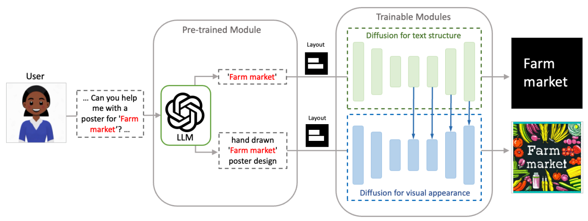

[toc]

> [ARTIST: Improving the Generation of Text-rich Images with Disentangled Diffusion Models and Large Language Models](https://arxiv.org/abs/2406.12044)

> 感觉像是绕了一个大弯的“翻版” controlnet，思路还是可以看一下的
>
> 一直在对标 TextDiffuser，但感觉更像是 TextDiffuser-2，可惜只在 Related Work 里提了一下 v2，后续实验就只有在 User Study 里出现了

# 贡献

- 使用更先进的 <u>*LLM (e.g. GPT-4) 来预测 keywords 和 layout*</u>
- 提出了一个两阶段模型，都使用了 diffusion model；其中第一阶段使用 <u>*diffusion model 的 decoder 的输出作为类似 “草图”*</u>，输入到第二阶段模型中进行<u>*生成*</u>

# 思路

## ARTIST Framework

### 第一阶段：学习提取字形特征

**数据集**

- <u>*Word-level dataset*</u>：构建黑底白字的图像，但保证每张图上只有一个 word，同时获取到每个 word 对应的 bbox

- <u>*Sentence-level dataset*</u>：来自 MARIO-10M，通过数据集已经提供的 bbox 和 word，重新绘制成黑底白字的图像，并且每张图上可能有多个 word

**训练过程**

1. 模型使用 diffusion 结构。先在 Word-level dataset 上训练，输入是 bbox 和要绘制的文本 (以字符串的形式)，<u>*输出是黑底白字的图像*</u> (类似 Pillow 绘制的“草图”，不过这篇论文选择通过模型学习得到)；损失函数使用重建损失

   此时，decoder 中应该<u>*提取了与字形和位置相关的特征*</u>

2. 在 Sentence-level dataset 上训练，输入变成画了多个 bbox 的图像和多个 word

### 第二阶段：学习融合字形特征生成图像

**数据集**

- 应该是直接使用 MARIO-10M 了

**训练过程**

1. 第一阶段模型的 decoder 的输出，通过一系列的卷积网络，和第二阶段模型<u>*对应的 decoder 进行相加融合*</u>

   > 原文：For each intermediate feature from the mid-block and up-block layers of text module, we propose to use a trainable convolutional layer to project the feature and <u>*add it element-wisely*</u> onto the corresponding intermediate output feature of the visual module.
   >
   > ControlNet 用的是先和 Encoder 融合再和 Decoder 融合，而这篇论文 <u>*ControlNet 直接和 Decoder 相加融合*</u>

   损失函数使用重建损失

2. 第一阶段训练好的模型被冻结；融合中使用的卷积网络和第二阶段模型被训练

### 推理过程

- 在推理过程中，用户仅需要与 LLM (e.g. GPT-4) 进行对话 (不需要用引号包裹 keyword e.t.c.)；LLM 将负责提取出 keyword 并设计出 layout

  > 这一部分感觉和 TextDiffuser-2 真的一模一样，但在 TextDiffuser-2 里面只是一个小的贡献点，而这篇论文感觉已经占了 1/3 的贡献比重

# Evaluation Metric

- FID
- OCR-Acc
- CLIP score

