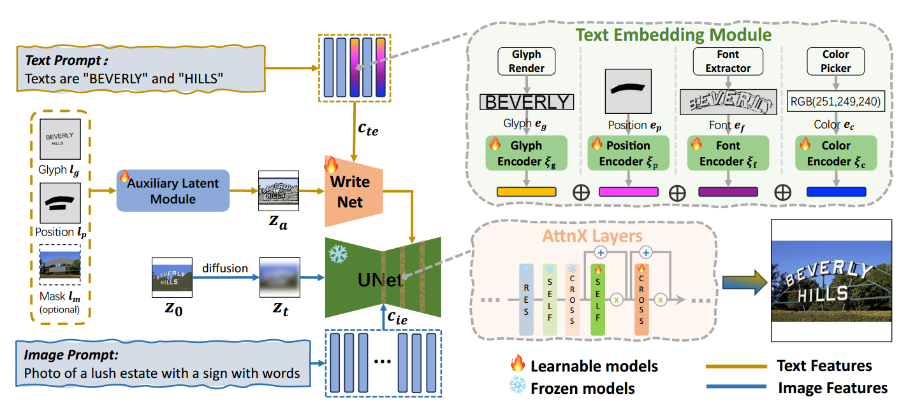

[toc]

> [AnyText2: Visual Text Generation and Editing With Customizable Attributes](https://arxiv.org/abs/2411.15245)
>
> [源码](https://github.com/tyxsspa/AnyText2)

# 贡献

- 沿用 AnyText 中 <u>*Text Embedding Module*</u> 的思路，除了 glyph 信息，<u>*额外提供位置、颜色、字体信息*</u>
- 类似 GlyphDraw-2 的思路，类似 ControlNet 的模块<u>*专门负责文本的生成*</u> (类似做了解耦)；ControlNet 与 UNet 的<u>*融合方式也转为 attention 机制*</u>

> Related Works 中的 Visual Text Generation 部分写的不错，可以参考

# 思路

## Framework

- 损失函数：重建损失 l2 loss

  > AnyText 提出的 Text Perceptual Loss 不知道为什么没有再提了

### Text Embedding Module

**Glyph $e_g$**

- 这部分与 AnyText 一致 (i.e 使用 PP-OCR v3 分类网络前一层输出的特征)

> 在 AnyText 中，OCR Encoder 是冻结的，进行训练的只是一个 linear 层；这里不知道是不是同样的含义

**Position $e_p$**

- 通过一个卷积 + 池化网络 (i.e 上图中的 $\zeta_p$) 转为 embedding

**Font $e_f$**

- Font Extractor 的作用应该是类似提取 canny map

- 在提取完成后，还会利用旋转、变形、添加 mask 等方式<u>*破坏 canny map 中的字形信息*</u> (可能是为了防止模型从 $e_f$ 中学到的是 glyph 而不是 font)

  >原文：The font image $e_f$ in the third image is extracted by the font extractor. To prevent the leakage of glyphs, various transformations such as rotation, translation, scaling, and occlusion are applied.

- $\zeta_f$ 同样使用 OCR model 的结构和权重；<u>*没有被冻结*</u>

**Color $e_c$**

- Color Picker 应该主要是通过聚类选出文本中最多出现的颜色然后求平均

  > 原文：Initially, the colors of all pixels within the text region are clustered and ranked, from which we select the top dominant color blocks. We then analyze their shapes and positions using morphological analysis techniques to identify the most likely text blocks, outputting the mean RGB value as the text color $e_c$.

- $\zeta_c$ 就是一个简单的 linear 网络

以上这些 embedding 会通过<u>*相加融合*</u>；并且仍然沿用替换的方式 (i.e. 记录对应 token embedding 的位置然后替换)

### Auxiliary Latent Module

- 新的 **WriteNet 模块**被<u>*删除了时间步 $t$ 的输入*</u>

  此外，类似 GlyphDraw-2 的做法，WriteNet 部分的 prompt 尽量<u>*只涉及文本相关的部分*</u> (而不包括背景描述)

- **AttnX Layers** 的作用是<u>*替代了 ControlNet 中的相加融合*</u>；(与 GlyphDraw-2 的 TCA 模块类似) WriteNet 的输出作为 cross attention 中的 <u>*key、value*</u>，通过 self-attention + cross attention 融合信息

## 数据集

- 还是 AnyWord-3M；不过重新使用 QWen-VL 生成 caption，并且 <u>*caption 的长度有较大的提升*</u> (8 words -> 47 words)

# Evalution Metric

- OCR Acc
- NED
- FID
- CLIP Score

# Ablation

- Text Embedding Module 新增的 embedding 是有效的
- WriteNet + AttnX-Layer 的设计是有效的

- 更长的 caption 有助于提升效果