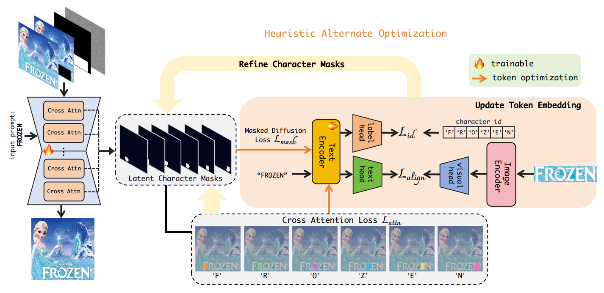
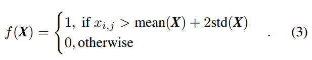
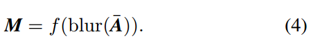
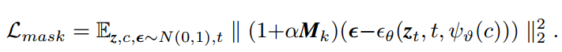
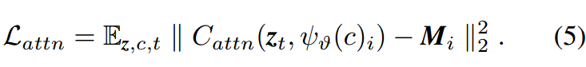
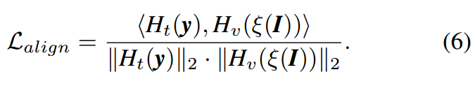
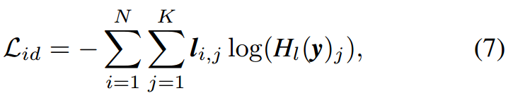
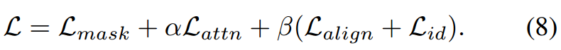

[toc]

> [DreamText: High Fidelity Scene Text Synthesis](https://arxiv.org/abs/2405.14701)
>
> [源码](https://github.com/CodeGoat24/DreamText)

# 贡献

- 使用 <u>*cross attention*</u> 注入 character-level 的位置信息；同时，<u>*character-level 的 mask*</u> 不来自于 gt 和用户输入而是<u>*通过预测得到*</u>
- 从位置信息 mask，ROI attention，类似 CLIP 的对比 (相似度) 损失，text embedding 通过分类器获取 character id 这几方面<u>*构建新的损失函数*</u>

# 思路

## Framework

- 基于 SD v2.0 的结构和权重；Text Encoder 使用 UDiffText 的 text encoder (类似 CLIP 的训练得到的兼顾文本语义和视觉语义的 character-level encoder)；Image Encoder 使用 ViT 结构

### 预测 charactler-level mask

- 将 <u>*text embedding 作为 key、value*</u> (i.e. 这里<u>*使用 attention 来预测 mask*</u>，需要和将 attetntion 计算 ROI 区分开)，对于每一层 cross attention 的同一个 character 的 attention 值求平均，得到 $\bar A$

  然后，通过<u>*高斯模糊平滑*</u> (最终为了防止 mask 边缘过于锐利)，再经过以下两个公式，<u>*计算得到 mask*</u>，

  

  

- 在训练的前期 (论文中设置为前 25, 000 steps)，不进行 mask 的预测，而是直接<u>*使用 gt 中的 character-level 的 mask*</u>

  > 3.2.1. Heuristic Alternate Optimization 章节提到了一个“交替训练”，好像是 mask 和 text encoder 会交替进行训练，但是具体的操作不太清楚

### 损失函数

- 用预测得到的 mask <u>*加强文本区域的重建损失*</u>

  

- 位置 mask 部分对应要成文本的 <u>*attention 的值要尽可能的大*</u>

  

  > 这里直接使用 mask 的值 (i.e. 0 和 1) 来作为类似 "gt" 的项，不过 0 和 1 会不会有点过于极端了？

- 计算 text embedding 和 text visual embedding (输入的文本图像来自于 gt) 之间的 cosine similarity (类似 CLIP)

  

- text embedding 通过 classifier 计算 CE，监督 Text Encoder 以 character-level 进行编码

  > 理论上直接使用了 UDiffText 的 text encoder，这个损失函数好像有一点重复了

  

- 完整的<u>*损失函数*</u>，

  

## 数据集

- SynthText：人造数据，0.8M images；8M words；有 character-level 的 bbox

  > [可以直接使用的 SynthText](https://academictorrents.com/details/2dba9518166cbd141534cbf381aa3e99a087e83c)
  >
  > [用于人造数据的代码](https://github.com/ankush-me/SynthText)

- LAION-OCR：9M images；有 character-level 的 bbox

  > 但网上搜不到这个数据集

- ICDAR13：200 images 用于测试；基本是水平文本

- TextSeg：4000 images；带有文本

# Evaluation Metric

- 在 evaluation 时论文中分为两种任务，（1）reconstruction task：mask 掉 gt 上的文本，要求还原这个文本（2）edit task，要求还原另外的文本
- OCR Acc
- LPIPS：使用预训练的网络 (e.g. AlexNet)，比较每一层输出的 feature map
- FID

# Ablation

- 损失函数设计有效
- 初期使用 gt 中的 mask，后期进行 mask 的预测是有效的