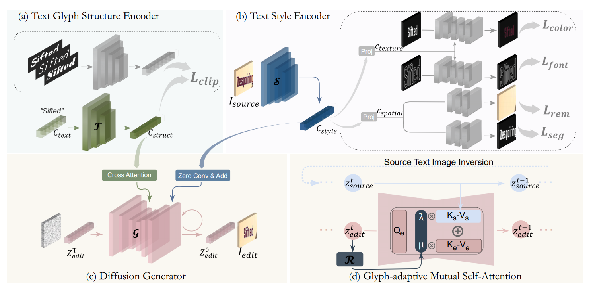
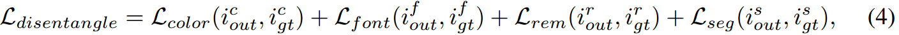
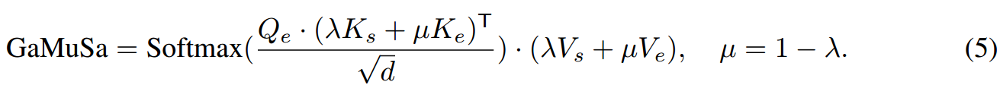
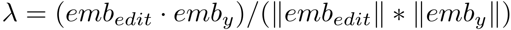

[toc]

> [TextCtrl: Diffusion-based Scene Text Editing with Prior Guidance Control](https://arxiv.org/abs/2410.10133)
>
> [源码](https://github.com/weichaozeng/TextCtrl)
>
> NeurIPS 2024

# 贡献

- 构建了 *<u>character-level 的 encoder</u>* 对 glyph 进行编码
- 在 <u>*texture 和 spatial*</u> 两方面，以<u>*一系列预设置的任务计算损失函数*</u>，来监督 style embedding 的提取是否正确
- 在<u>*推理阶段*</u>，增加一个<u>*不进行 edit 操作的分支*</u> (i.e. 尝试重建 gt)，通过 <u>*self attn 机制引导 edit 分支的生成*</u>
- 提出了 <u>*ScenePair Benchmark*</u>

# 思路

## Framework

**Text Glyph Structure Encoder**

-  *<u>character-level 的 encoder</u>*，使用 <u>*CLIP 结构*</u>；论文提出使用多种 font 绘制 glyph (而不是 UDiffText 中只使用固定的 font)

**Text Style Encoder**

- 将提取到的 style embedding 分为 $c_{texture}$ 和 $c_{spatial}$ 两个分支，<u>*使用提取出的 embedding 执行*</u>颜色、字形、去除文字、文字分割这 <u>*4  个任务*</u>；根据对这 4 个任务执行情况的监督，间接<u>*监督 style embedding 是否提取出了足够的信息*</u>

  > 4 个任务的具体内容可以参考 3.2 Text Style Disentanglement Pre-training

- **损失函数**

  

**推理时优化 —— Glyph-adaptive Mutual Self-Attention (GaMuSa)**

- 通过 <u>*self attn 机制和权重*</u>融合 edit 和重建分支 (source)

  

  权重计算方式为，

  

  > 可能意思是一开始相似度低，说明 edit 部分生成的还不好，就先不参考原图多做一些修改，等相似度逐渐上去了，就不对文本进行过多的 edit 了，而是根据原图把背景调整一下；可能也是<u>*某种层面上实现了文本和背景的解耦*</u>

# Evaluation Metric

- **ScenePair Benchmark**，从同一种风格的文本中，找到近似长度的文本作为相互替换的文本，在 <u>*style 层面上进行评估*</u>

  

- SSIM

- PSNR

- MSE

- Seq-Acc

- NED

