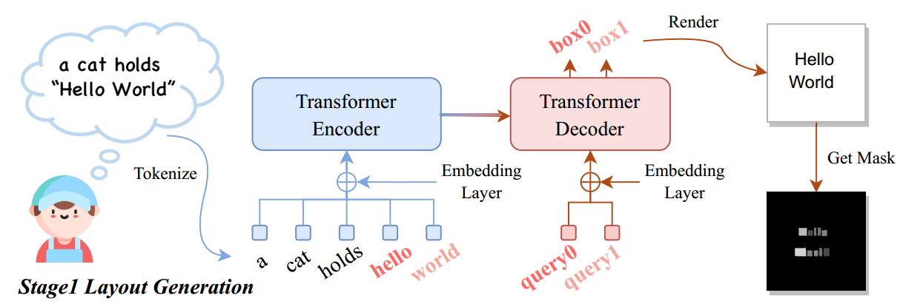
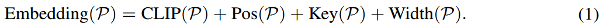
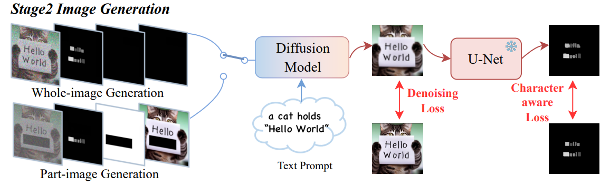
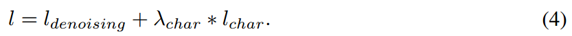

[toc]

> [TextDiffuser: Diffusion Models as Text Painters](https://arxiv.org/abs/2305.10855)
>
> [源码](https://github.com/microsoft/unilm/tree/master/textdiffuser)
>
> NeurIPS 2023

# 贡献

- 提出一个两阶段的模型，第一阶段预测文本在图像中的 layout，第二阶段通过掩码提供额外的信息来生成图像
- 提出基于从字符获取到的 mask 的损失函数
- 提出数据集 MARIO-10M

# 思路

## TextDiffuser Framwork

### 第一阶段：文本布局预测

- 对需要被生成的文本 (论文中称作 keyword) 进行编码

  

  > 应该是对每个 token 都进行新的编码，这里 tokenization 应该也有特殊的设置 (keyword 可能限制为一个 token)

  - <u>*CLIP*</u> 是对整个 caption 的编码

  - <u>*Pos*</u> 指的就是 PE (并且这里使用的好像就是 transformer 初版的 Sinusoidal 编码)

  - <u>*Key*</u> 表示是否是 keyword

  - <u>*Width*</u> 表示 keyword 的宽度 (这个宽度由 pillow 和固定的字体以及字号决定)

    > 提升维度的方式可能类似 diffusion model 中对时间步 t 的处理

  使用<u>*相加融合*</u>上述 4 个编码

- 在 transformer decoder 部分，<u>*decoder 的输入 (i.e. query) 是 keyword 对应的 PE*</u>

  > 估计 decoder 是一次性直接输入 k 个 PE，然后预测出 k 个 bbox，只做一次预测

  <u>*decoder 的输出是一个长度为 `(K, 4)` 张量*</u> (无视 batch_size，假设共 K 个 keywords)，4 表示左上点的坐标和右下点的坐标

- 有了 decoder 输出的坐标后，就可以使用 pillow 来绘制“草图”了

  > 确实可能出现 bbox 的长宽比例与 keyword 的宽度不匹配的情况，造成 bbox 中有空白

  绘制完草图后，再使用 pillow <u>*提取出每个字符的 mask*</u>；具体地，这些 <u>*mask 组成一个 `(|A|, h, w)` 的张量*</u>，其中 `|A|` 表示字符表的长度 (论文中设置为 95，包括大小写字母和一些特殊字符)

  > 看起来如果有相同的 character，mask 都会被提取到对应的 channel 中

- <u>损失函数针对 bbox 进行监督</u>，使用 l1 loss

### 第二阶段：生成图像

- 通过上一阶段得到的 shape 为 `(|A|, h, w)` 的 mask 张量

  mask 的 channel 会从 `|A|` 被压缩到 8，然后应该是<u>*在 channel 上和 VAE encoder 输出的图像 concat*</u>

  > 没有使用 ControlNet 结构

- 在通道上还会拼接 1-D 的 feature mask (i.e. 只有 mask 是白的，其它是黑的) 和 4-D 的 masked feature (i.e. 只有被 mask 区域是黑的，其它部分是原始图像)

  <u>*inpainting 模型和全图生成模型一起训练*</u>，全图生成视作将 mask 覆盖全图即可融合两种生成模式；通过一个超参数随机选择使用哪个训练支线

- 除了重建损失，还<u>*引入了 $l_{char}$ 损失函数*</u>

  论文中额外训练了一个模型用于从生成图像中提取出文本的 character-level 的 mask；然后应该是和第一阶段输出的 mask 进行损失计算

  最终的损失函数为，

  

# 数据集 MARIO-10M

> [数据集地址](https://drive.google.com/file/d/1gzaW8i07Fn7-zWiP2ZwtkH_E0-2qPgJx/view?usp=sharing)

- <u>*数据集组成，*</u>

  - LAION-400M：通过 OCR 筛选出有字符的图像

  - TMDB：电影海报

  - OpenLibrary：书本封面

    TMDB 和 OpenLibrary 缺少可以直接使用的 caption，所以会用类似 `A movie poster named {XXX}` 类似的提示词模板

- <u>*数据集过滤，*</u>

  - 分辨率大于 256*256

  - word 数量小于 9

  - 文本区域占 10% 以上

  - OCR 检测到的文本至少有一个出现在 caption 中 

    > 但不太清楚没有出现在 caption 中的文本会被丢弃还是保留

- 数据集中的文本基本是水平的，使用方形的 bbox 可以比较好的标定出来

# Evaluation Metric

- FID
- CLIPScore：使用 CLIP 计算 cosine similarity
- OCR evaluation：OCR 任务中的常用指标

# Ablation & Limitation

- 在编码过程中考虑 keyword 的 width 是有意义的
- 引入 character-level 的 mask 作为输入；增加监督 character-level 的 mask 的损失函数是有作用的
- 通过不同训练分支同时训练全图和 inpainting 模型是可行的

---

- 可用通过 prompt 对文本的颜色进行控制，但是估计不多
- 单个 word 的 character 不能太多，多了生成的准确性会下降
- 图像中的 word 的数量不能太多，不然 bbox 的布局预测可能会有问题 (重叠等)

