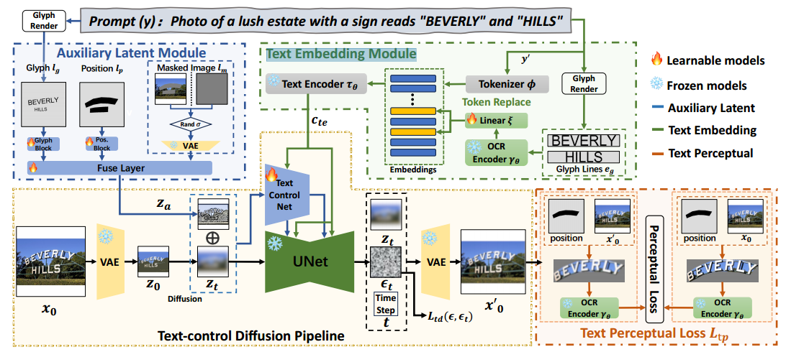
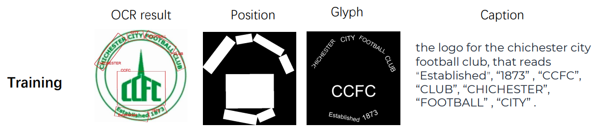
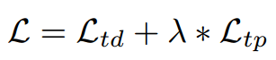

[toc]

> [AnyText: Multilingual Visual Text Generation And Editing](https://arxiv.org/abs/2311.03054)
>
> [源码](https://github.com/tyxsspa/AnyText)
>
> ICLR 2024

# 贡献

- 构建了一个双模块模型，提供字形和位置信息的 <u>*Auxiliary Latent Module*</u> 和在编码中提供字形信息的 <u>*Text Embedding Module*</u>
- 提出了 <u>*Text Perceptual Loss*</u>，更好地监督字形和位置是否生成正确
- 提出了 <u>*AnyWord-3M*</u> 数据集


# 思路

## AnyText Framwork




### Auxiliary Latent Module：视觉方式控制位置和字形

- 这一个模块的输入包括<u>*三部分*</u>，

  - $l_p$：使用 OCR model (e.g. PPOCR-v3) 提取 gt 中文本的 bbox，通过这个 bbox 绘制一个 mask 作为位置信息

  - $l_g$：利用 $l_p$ 中的 bbox，使用 Pillow 以固定字体 (.ttf) 绘制“草图”、

  - $l_m$：选择全图生成分支训练时，整张图都被 mask；而选择 impainting 分支训练时，只有 $l_p$ 的部分被 mask (i.e. $l_m$ 对应的是 masked image)

    > $l_p$ 可能已经可以看做 mask 了，所以 inpainting 支线不需要重复输入了

  这三个部分通过一个卷积网络 (i.e. 上图中的 Fuse Layer) 融合

- 在推理过程中，用户提供的是 $l_p$，i.e. 手动绘制 mask (理论上画 bbox 也可以，但好像使用的不多)，从这个 mask 中提取出外接多边形，然后通过 Pillow 渲染出“草图”，融合后作为输入

  > 用户绘制的 mask 可能很复杂，使用外接多边形确实可能无法完全与用户的输入一致，从而导致“草图”绘制不准确

- 由于 OCR 主要输出方形的 bbox，据此绘制出的 mask 也可能过于“方正”，这与用户比较“粗糙“的 mask 是有一定区别的；为了弥合数据和现实的差距，多边形区域形成的 <u>*mask 有概率被腐蚀或膨胀*</u>

  此外，OCR 本来就能够将 curved (弯曲的) 文本分为多个 bbox 提取出来，所以这种情况<u>*无需额外处理*</u>

  


### Text Embedding Module：以编码方式控制字形

- 使用 Pillow 在中心位置，以固定字体和字号绘制另一份“草图”；然后，从这份“草图”中，利用 OCR model 进行提取，将全连接层前一层的输出 (理论上包含了提取出的字形特征) 作为替换目标 token embedding (OCR Encoder 处于冻结状态)

  通过一个 linear 层对齐维度同时因为有这个 linear 层，Text Encoder 也可以处于冻结状态

- 在 prompt 中，被绘制的文本会被包裹在双引号中，在进行 tokenization 前可以被识别到并替换为某个特殊的字符 (e.g. `*`)，然后在 tokenization 结束后，记录这个特殊字符对应的 token id，通过 Embedder 后，<u>*将这个 id 对应的 embedding 替换为 OCR Encoder 的输出*</u>


### TextControlNet

- AnyText 使用 ControlNet 和 SD v1.5 的结构与权重

- Auxiliary Latent Module 的输出 $z_a$ 与上一时间步的输出 $z_t$ 通过<u>*相加融合*</u> (注意，没有在通道上 concat)，作为 ControlNet 的输入

  而 $z_t$ 则作为 UNet 的输入 (UNet 冻结，ControlNet 训练)

- AnyText 支持全图生成和 inpainting 任务，两个支线一起训练


### Text Perceptual Loss

- Text Perceptual Loss 指通过 $l_p$ 中的 mask 将生成图像中应该有文本的位置提取出来，然后还是利用 OCR 全连接层之前的 feature，计算 l2 loss

  $L_{td}$ 是重建损失，$L_{tp}$ 是 Perceptual Loss

  

- 这存在一个问题，就是需要还原到原始图像才能用 OCR 做提取，对于加噪比较多的时间步，还原出的图像质量会比较差，OCR 效果很可能会受到影响，导致 loss 偏大；所以需要一个按照时间步逐渐变化的权重来控制 loss (图像质量较差的时间步的 loss 的权重要小一些)，权重变化使用了 DDPM 中线性加噪的 $\beta$


## AnyWord-3M 数据集

>[数据集地址](https://modelscope.cn/datasets/iic/AnyWord-3M/summary)

- 数据集<u>*筛选条件*</u>，

  - v1.0 版本的数据集，

    - 长或宽大于 256，长宽比适中

    - 文本所占面积大于 10%

    - 行数小于 9

    - 文本不能太小，高度超过 30 pixel

    - OCR 识别具有一定的置信度

    - 图像中必须有被检测到的文本

  - v1.1 版本的数据集，

    - 中英文图像的比例基本为 1:1

    - 使用更准确的 PPOCR v4 模型进行提取

    - 对于文本过长、行数过多、字体过小等情况，使用 mask 标记为“无效”，在计算 loss 时置零

      > 可能是这样操作可以将 v1.0 中被丢弃的数据继续利用起来

    - 对有水印的图像进行检测，并且提出 wm_score，保证图像的 wm_score < 0.5

- <u>*数据集构建*</u>，

  - caption 和 OCR 检测结果通过提示词模板融合在一起

    ```
    模板类似于，“, these texts are written on it: ”
    e.g. “a button with an orange and white design on it, these texts are written on it: *, *, *, *”
    ```


# Evaluation Metric

- OCR-Acc：生成的字符全都一样才得分
- NED：i.e. LD (通过替换、添加、删除，需要多少步可以将两个字符串变为一致)；是一种更宽松的字符串相似度衡量标准
- FID


# Ablation

- 使用 OCR 的输出做 embedding 是最好的选择
- 提供额外的 mask 作为位置信息是可行的
- Text Perceptual Loss 有效