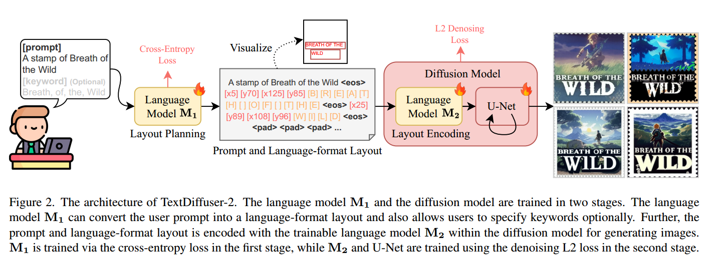

[toc]

> [TextDiffuser-2: Unleashing the Power of Language Models for Text Rendering](https://arxiv.org/abs/2311.16465)
>
> [源码](https://github.com/microsoft/unilm/tree/master/textdiffuser-2)

# 贡献

- 相较于 TextDiffuser 使用的 character-level 的 mask，v2 使用一种<u>*新的编码方式提供文本的内容、位置信息*</u>等
- 改为使用<u>微调后的大语言模型进行 layout planning</u>

# 思路

## 新的 layout planning

> 在论文中，这个模型称作 M1 模型

- 对 vicuna-7b-v1.5 进行<u>*微调*</u>，目的是给出 keyword 的 layout (bbox 的左上点和右下点)，训练数据来自于 MARIO-10M

  > 这一部分的训练应该和 TextDiffuser 中的 layout planning 很接近

  此外，如果用户连 keyword 都不提供，也可以<u>*预测哪些文本属于 keyword*</u>

- 另外，由于使用了大语言模型，具有一定<u>*通过“对话”调整*</u>布局、文本的能力

## 新的编码方式

> 在论文中，这个模型称作 M2 模型

- 对于<u>*位置信息*</u> (e.g. `[x5] `) 和<u>*需要绘制的文本*</u> (e.g. `[B]`) 等，都使用 <u>*special token*</u> 进行 tokenization

  位置信息被归一化到 0~128 上，对于 x 和 y 轴分别准备共 256 个 <u>*coordinate tokens*</u>；同时复用了 TextDiffuser 中 95 个 <u>*character tokens*</u> (大小写英文字符和一些常用符号)

- 使用 `<eos>` 对不同类型的信息<u>*进行分隔*</u>

- 因为编码方式别修改，且内容变多；论文<u>*训练了一个新的 Embedder*</u>，并且将 seq_len 提升到了 128

  > 论文中没有提到这个编码模型 (i.e. M2) 的具体模型结构

- UNet 使用 SD v2.1 的结构和权重；训练 UNet 仅使用了 reconstruction loss

- 论文中还尝试了在编码中加入更多的对文本属性的控制

  e.g.  角度 angle，加入控制角度的  181 个 special token (从 -90° ~ 90°)；e.g. 四边形 bbox，将左上点和右下点坐标修改为四个点的坐标。为了容纳新的编码，seq_len 也扩充到 256

# Evaluation Metric

> 与 TextDiffuser 一致

- OCR
- CLIP Score
- FID

# Ablation

- 使用左上点和右上点作为位置信息是更好的选择 (e.g. 使用中心点不是很好的选择)

- 使用 character-level 的 tokenization 方式比 BPE 效果更好

- 即使在 layout planning 中出现了重叠的 bbox，仍然可以成功生成文本

  这可能是因为 TextDiffuser 使用 mask 作为输入，在位置控制上过于严格，而 v2 的编码的方式则给予了更多自由

