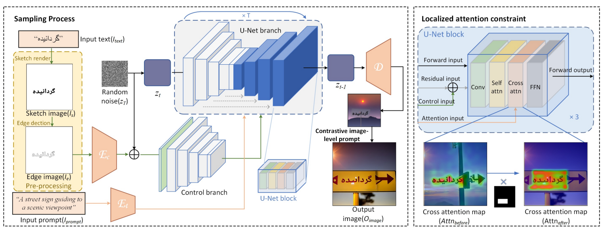
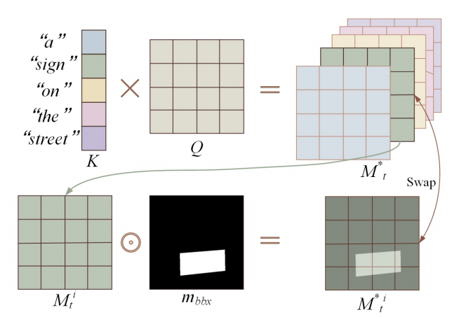
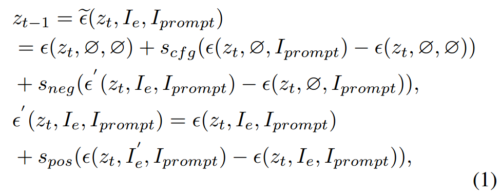

[toc]

> [Brush Your Text: Synthesize Any Scene Text on Images via Diffusion Model](https://arxiv.org/abs/2312.12232)
>
> [源码](https://github.com/ecnuljzhang/brush-your-text)
>
> AAAI 2024

# 贡献

- Diff-Text 是一个 <u>*training-free 的方法*</u>
- 向 ControlNet 输入从 Pillow 绘制的”草图“中的提取出到的 canny edge，来控制字形和位置
- 通过 Localized Attention Constraint 局部注意力约束文本所在位置的背景，以保证两者不相互影响
- 通过 Contrastive Image-level Prompts 对比图像级提示词 (类似 CFG) 来控制在生成时更多地考虑字形信息、控制信息和背景与文本生成的解耦

# 思路

## Diff-Text Framwork

### ControlNet + Canny Edge 控制字形和位置

- 使用 SD v1.5 + sd-controlnet-canny 的结构和权重

- 通过 Pillow 绘制出“草图”，然后从中提取出 canny edge
- prompt 的编码还是使用 CLIP (理论上 prompt 中提不提供要绘制的文本好像都行，反正靠的是 canny edge)

### Localized Attention Constraint

- 目前的问题在于，提取出的 canny edge 可能被模型误解读为背景而非文本；论文提出的解决方案，是将文本所在区域附近的背景的生成和文本本身的生成“解耦”

- 在输入中，除了提供文本，还会<u>*额外提供 bbox*</u>，框定了附近区域的大致范围；此外，prompt 中要包括 `“sign”, “billboard”, “label”, “promotions”, “notice”, “marquee”, “board”, “blackboard”, “slogan”, “whiteboard”, “logo”` 之类的“关键字”，这些实体就是文本所在的背景

  > In the framework, the positions of text within Is are either user-specified or randomly placed, which means, obtaining the corresponding text bounding box is straightforward.

  通过 bbox 可以绘制一个 mask，在 cross attention 中这个 mask 要和上述这些“关键字”关联起来 (i.e. ROI)

  > e.g. 上图中白色的 $m_{bbx}$ 就是 "sign" 这个“关键字”大致的位置和形状，两者关联起来

### Contrastive Image-level Prompts

- $I_e$ 表示 canny edge；而 $I^{'}_e$ 表示还将 <u>*bbox 以 1 pixel 的宽度也绘制到 canny map 中*</u> (理论上这相当于在文本外还额外提供了背景的控制)

  > 类似于 CFG，可以看做是往受 $I_e$、$I^{'}_e$ 控制的方向多生成一些

# Evaluation Metric

- CLIP score
- OCR Acc
- NED / LD

# Ablation

- Localized Attention Constraint 是有效的
- Contrastive Image-level Prompts 是有效的

