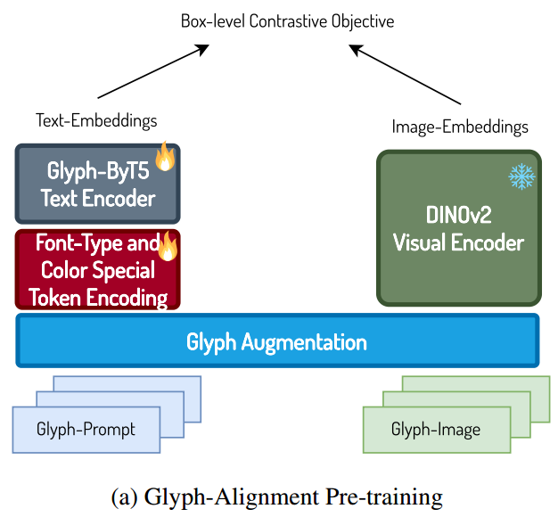
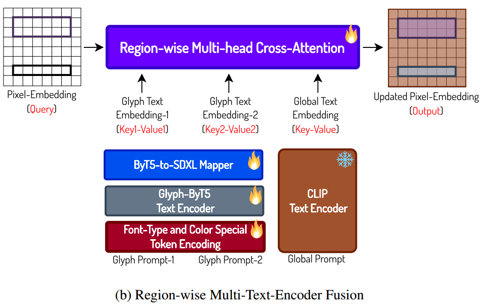

[toc]

> [Glyph-ByT5: A Customized Text Encoder for Accurate Visual Text Rendering](https://arxiv.org/abs/2403.09622)
>
> [Glyph-ByT5-v2: A Strong Aesthetic Baseline for Accurate Multilingual Visual Text Rendering](https://arxiv.org/abs/2406.10208)
>
> [源码](https://github.com/AIGText/Glyph-ByT5)
>
> ECCV (75) 2024

> 这篇论文好像涉及到侵权问题，所以源码、rebuttal、数据集等都没了，基本相同的内容发了两篇论文

# 贡献

- 使用<u>*对比损失*</u> (e.g. CLIP 的训练方式)，利用 ByT5 (参数量约 1B) 和 DINOv2 <u>*训练一个 character-aware 的 encoder*</u>

  <u>*box-level 的对比损失函数*</u>

- 使用 <u>*cross attention*</u>，将对“文本”的注意力和图片其他部分生成时的<u>*注意力进行分离*</u>

- 构建<u>*多个层级的数据集*</u> (i.e. word、sentence、paragraph)

- 将<u>*字体和颜色 encode 到文本编码中*</u>


# 思路

## 数据集 Glyph-Text & Paragraph-Glyph-Text 构建

> 数据集不开源，好像侵权了


- 黑色背景，数据集中提供了单独抠出来的文字

- 关于<u>*文字部分的 caption*</u> (e.g. 上图)，

  ```
  e.g. {Text “The way you create a better future is by studying the past.” in [font-color-127], [font-type-234]. Text “Happy Graduation Amber” in [font-color-98] [font-type-231]}
  ```

  > 不知道是不是直接把这个 caption 作为 Glyph-ByT5 的输入，毕竟包含了 "Text" "in" "," 之类无用的文本
  >
  > `[font-color-127]` 之类的会整体被分成一个 token，估计颜色和字体都是有限的，所以可以通过枚举来分词

  整体图像的 caption 用 LLaVA 提取

- 通过<u>*替换、重复、丢弃等来做数据增强*</u> (e.g. (1) character replacement (Happy → Hdppy). (2) character repeat (Happy → Happpppy). (3) character drop (Happy → Hapy).)

  > 估计 "Happy Graduation Amber" 是用 pillow 之类的方式直接拼上去的，所以才可以随意做修改

- 一共收集了 **Glyph-Text** 和 **Paragraph-Glyph-Text** 两个数据集

  论文中提出了 <u>*word、sentence、paragraph*</u> 三个层级 (论文中也称作 box) 的数据，主要的区别是包含 character 的数量；Glyph-Text 1M 左右数据，平均每张图 2 到 3 个 box，一共 20 左右个 character，而 Paragraph-Glyph-Text 0.1M 左右数据，平均每张图 2 到 3 个 box，总 character 可以到 380 个左右

  Paragraph-Glyph-Text 主要是为了<u>*提升模型对小字符和长文本的生成能力*</u>，让模型学会布局 (e.g. 字之间的对齐，空格大小等)


## Design-to-Scene Alignment

- 本质上是又搞了一个数据集，是<u>*在训练结束后再进行微调时使用*</u>
- 数据集中包括 3 个小数据集，
  - TextSeg：文本检测和风格数据集 (图像中基本都有文本存在)
  - SDXL 生成的图像

  - design images：真实的图像 (似乎图像中基本没什么文本)

> 感觉是最后调整平衡一下 SDXL 本来的能力和新的文本生成能力，每个数据集都是 4000 张
>
> 这些数据集居然还做了单独的消融，估计能证明这些数据集确实在平衡不同的能力


## Glyph-ByT5 模型



- ByT5 作为 text encoder，DINOv2 作为 visual encoder；通过<u>*对比学习*</u>来训练

- **Box-level Contrastive Loss** 

  对于 visual encoder，不只是一整张图提取一个 embedding，还会<u>*按照文本的 level 计算对比损失*</u> (e.g. 文本是以段落为单位，就每个段落提取一个 embedding 分别算 contrastive loss)

  > 感觉相当于使用 contrastive loss 替代了 ocr loss 之类的来监督文本生成的正确性；没有消融，不确定是不是真的比 ocr loss 好
  >
  > 数据集中应该是有 bbox 的

  **Hard-negative Contrastive Loss**

  在数据增广的过程中，会有一些很接近的数据 (e.g. "Happy" 变成 "Happpy")，<u>*将这类易错的数据当做负样本*</u>计算对比损失

  最终的损失函数，是 $L_{box}+L_{hard}$

- **Font-Type and Color Special Token Encoding**

  用于把 color 和 font-type 整体分词 (e.g. `[font-color-98]`)


## Glyph-SDXL

- 当有了 Glyph-ByT5 后，就可以对 prompt 中涉及文本的部分进行编码，得到的 embedding 需要和完整 prompt 的 embedding <u>*分开进行计算*</u>

- **Region-wise Multi-head Cross-Attention**

  把图像分为被 bbox 框住的 (e.g. 框住的可能是 word、sentence、paragraph) 和没有的；<u>*框住的部分只和对应文本的 embedding (来自 Glyph-ByT5) 做 cross attention，没有的部分只和全局的 text embedding (来自 CLIP) 做 cross attention*</u>

  

  *<u>图像的 embedding 作为 query，Glyph-ByT5 和 text 的 embedding 作为 key、value</u>*；<u>*通过 mask*</u> 可以实现这个需求

  > 这个 cross attention 不知道放在了什么位置，可能是替换了 SpatialTransformer 中的 cross attention

  **ByT5-toSDXL mapper**

  把 Glyph-ByT5 输出的 embedding 和原始 SDXL 中 CLIP 输出的 embedding 的<u>*维度对齐*</u> (i.e. `encoder_hidden_states`)

  这个 mapper 是一系列 transformer encoder 组成的；随机权重初始化

- 冻结与训练情况如上图

  > 但没搞懂为什么 Font-Type and Color Special Token Encoding 也是要训练的，这不是个分词器吗？
  >
  > 训练应该是两阶段的，大明白为什么训练 Region-wise Multi-head Cross-Attention 的时候 Glyph-ByT5 Text Encoder 和 Font-Type and Color Special Token Encoding 不是冻结的？


# Evaluation Metric

- 基本上以检查生成图像中文本的准确度来衡量 (e.g. OCR 等)


# Ablation

- DINOv2 作为 visual encoder 是很好的选择
- Box-level Contrastive Loss 是有效的
- 数据增广是有效的
- ByT5-to-SDXL mapper 的设计是有效的
- 数据集要大一些，ByT5 不用最大但也要大一些
- cross attention 的设计关注到了文本应该在图像上出现的位置


