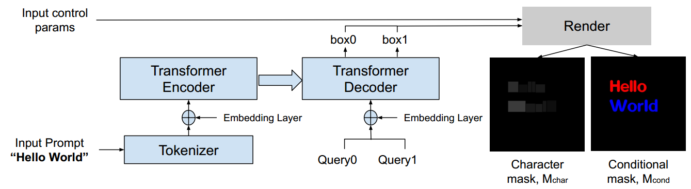
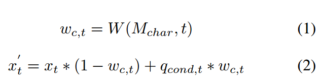
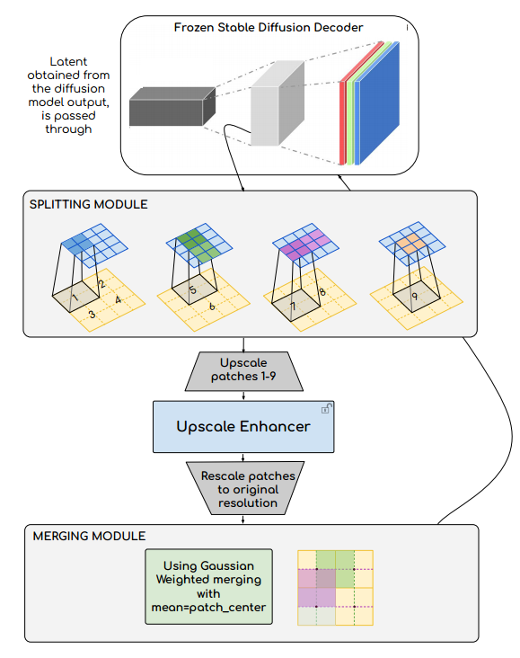

[toc]

> [CustomText: Customized Textual Image Generation using Diffusion Models](https://arxiv.org/abs/2405.12531)

# 贡献

- 延续 TextDiffuser 的思路，提出了一个两阶段模型。第一阶段对 character-level mask 和 glyph rendering (增加了颜色控制) 进行预测，第二阶段使用了相加融合的方式提供控制信息 (没有使用 ControlNet)
- 提出了两种不同的对小文本生成的方法。都是对 Decoder 进行提升，（1）通过 patch 的方式对小文本放大后进行修复，然后还原回去（2）为 Decoder 搭配 ControlNet，提供更多的控制
- 提出了以小文本为主的数据集 SmallFontSize

# 思路

## Framework

- 基于 TextDiffuser 构建

### 第一阶段：character-level mask 和 glyph rendering

- 继续使用 TextDiffuser 中预测 character-level mask 的结构 (i.e. $M_{char}$)

- 额外引入 glyph rendering，通过预测出的 bbox 绘制带有字号、位置、颜色信息的“草图” (可能还是 Pillow)

  > 虽然引入了颜色，但损失函数上没有特别的监督，只提供了控制条件，应该还是靠重建损失硬学的

### 第二阶段：权重相加融合

- 使用带有权重的相加融合。权重通过 $M_{char}$ 和时间步 $t$ 学习得到

  $q_{ccond,t}$ 是对应时间步加噪的 $M_{cond}$ 图像，随着接近生成的最后阶段，$w_{c,t}$ 越来越小 (i.e. 可能此时文本已经生成的比较好了，尽量不要影响其它部分的生成)

  

### 小文本处理

#### 方案一：在 VAE Decoder 中通过 patch 提升质量后还原

- 对于 UNet 输出的 (h, w) 的 latent image，提取为 9 个 overlap 的 (h/2, w/2) 的 patch，通过双线性插值还原回 (h, w)

  然后经过一个 Upscale Enhancer；Enhancer 结构基本是一个使用零卷积的卷积网络

  使用 l2 loss 和 character-aware loss 训练 Enhancer

- 将 patch 还原回 (h/2, w/2) 后，然后通过权重相加融合，距离当前 pixel 越近的 patch 有更大的权重

## 数据集

- CTW1500：一个专门用于曲形文本检测的数据集
- SmallFontSize：收集了小文本文字 (但是论文中没有详细介绍)

# Evaluation Metric

- OCR
- CLIP Score
- MSE
- PSNR：可以看做一种 MSE 的变体，主要反应图像质量
- SSIM：比较两幅图像的亮度、对比度和结构来衡量它们的相似性

