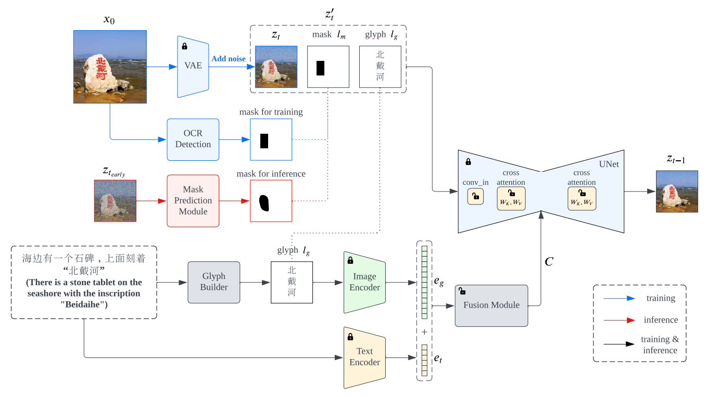
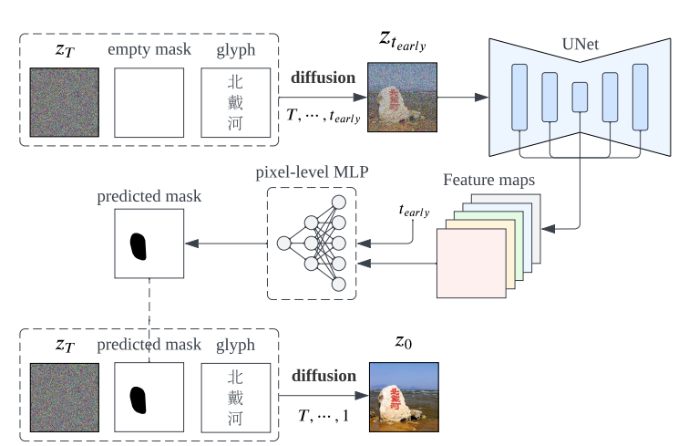
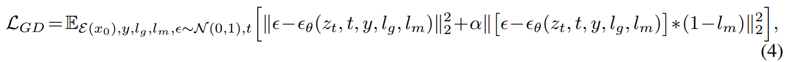
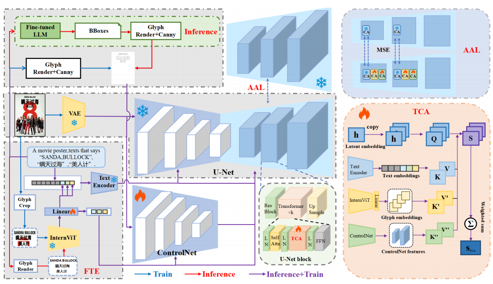
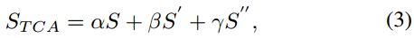
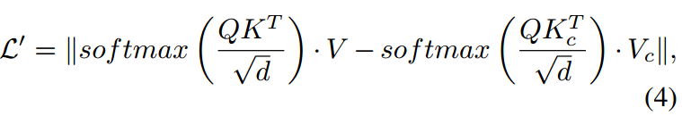
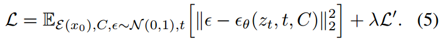
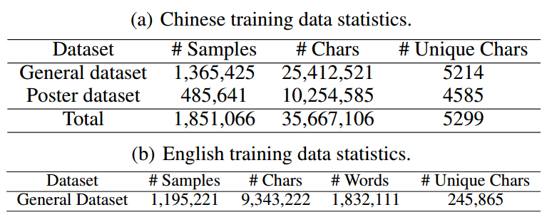
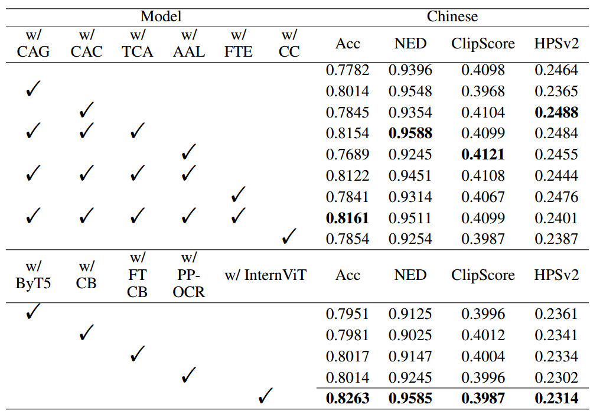

[toc]

> [GlyphDraw: Seamlessly Rendering Text with Intricate Spatial Structures in Text-to-Image Generation](https://arxiv.org/abs/2303.17870)
>
> [GlyphDraw2: Automatic Generation of Complex Glyph Posters with Diffusion Models and Large Language Models](https://arxiv.org/pdf/2407.02252v2)
>
> [GlyphDraw 源码](https://github.com/OPPO-Mente-Lab/GlyphDraw)
>
> [GlyphDraw2 源码](https://github.com/OPPO-Mente-Lab/GlyphDraw2)

# 背景：GlyphDraw v1

> 感觉是中文 text rendering 的开山作之一，效果不一定很好，但基本上思路已经和后续常用的模型很接近了

**位置信息**

- 在训练过程中，$l_m$ i.e. mask 来自 gt

- 而在推理过程中，mask 可以由用户提供；如果用户不提供，则在前几步中先将 mask 设置为空白，模型在 mask 为空的时候也有一定的文本生成能力，虽然字形不正确但可以提供大体的位置信息，然后通过一个 MLP 提取出 mask 替换掉空白的 mask，继续生成过程

  该 mask 预测模型也会使用 MSE 训练

  

**字形信息**

- 白底黑字居中绘制 (应该是也是用了 Pillow 之类的库)

**融合**

- $z_t$, $l_m$, $l_g$ 先在 channel 上 concat，然后经过一个 `conv_in` 卷积网络进行融合
- $l_g$ 还会被提取 visual token embedding，和 CLIP 的 token embedding 进行 concat 融合，作为 <u>*key、value*</u>
- 只有 `conv_in` 卷积和相关的 $W_k$ 和 $W_v$ 线性网络会被训练；大部分 UNet 都处于冻结状态

**损失函数**

- 对文本应该生成的位置 (i.e. mask 表示的位置) 处的重建损失给予更多的权重

# GlyphDraw2

## 贡献

- 使用 LLM 来预测 layout 和 font
- 使用新的视觉模型提取字形特征，并能够与和 text embedding 相同的方式被 UNet 学习
- 三重交叉机制，在 SpatialTransformer 中处理 text embedding 的 CA 以外，加入处理 ControlNet token 和 visual glyph token 的 CA
- 提出更多保证背景生成效果的损失函数
- 新的以海报为主的高分辨率数据集

## 思路

### Framework

- 基于 SDXL 构建

#### Fusion Text Encoder (FTE)

- 在训练过程中，会从 gt 中裁剪 (Glyph Crop) 出包含文本的部分 (可能是 OCR 检测文本，然后按照 bbox 割出来)

  改为使用 InternViT 来提取 visual token

- 使用线性网络 (Linear) 与 text embedding 进行对齐，然后将对应 text token embedding 替换为这些 visual token embedding (与 AnyText 的做法一致，不过 AnyText 用 OCR 模型提取 visual token)

- 因为有线性网络存在，原始的 Text Encoder 可以被冻结

#### ControlNet

- ControlNet 的输入是 Glyph Render 形成的”草图“的 Canny 图
- ControlNet 中 `encoder_hidden_states` 输入的不是 text embedding，而是 glyph visual embedding
- ControlNet 的融合方式不是和 Decoder 的对应层进行相加融合，而是以 CA 的方式进行融合

#### Triples of Cross-Attention (TCA)

- 在 Decoder 中，除了原本 SpatialTransformer 中的 CA，增加，

  - ControlNet 每层输出的 feature 作为 <u>*key、value*</u>
  - InternViT 提取出的 visual token embedding 作为 <u>*key、value*</u>

  增加方式不是直接复制 (不是多头)，然后通过一定的权重 (为超参数) 相加融合，

  

#### Auxiliary Align Loss (AAL)

- 对于原始处理 text embedding 的 CA，对使用 TCA 时和不使用 TCA 时的这一层 CA 的输出计算 l2 loss

  目的是在加入新的控制信息同时尽量维持原本的图像生成能力

  >有点好奇这样不会导致什么都学不到吗？可能是和重建损失相互拉扯到某个平衡点？

​									

### 数据集

> 数据集未开源

- General Dataset：PPOCR 提取文本，中英都有，BLIP-2 重新提取 caption (但具体来自什么数据集没有介绍)；1 - 3 行文本

- Poster Dataset：以海报为主的数据集；1-3 和 10 行文本

  过滤标准，

  - OCR 检测的置信度大于 0.8
  - 每个 bbox 中 n_character < 15；每张图中 n_bbox < 10
  - bbox 中心点落在底部 5% 图像面积内，则认定为是底端水印，丢弃；bbox 中心点距离其它 3 个边缘任意一个的 15% 图像面积外
  - 单个 character 的 bbox 面积大于 2000 pixel

## Evaluation Metric

- OCR-Acc
- NED
- Clip Score
- HPSv2：一个人类喜好评估模型的打分 (可以看做某种美学分数)

## Ablation

- TCA 中新增的两个 CA 都有效；损失函数有效；ControlNet 的修改有效 (i.e. CC)；InternViT 的提升

- GlyphDraw-2 有字体控制能力 (应该是 Canny 带来的好处)
- 微调 LLM 预测 layout 和 font (不过占比不大，应该和 GPT-4V、TextDiffuser-2 等类似)

